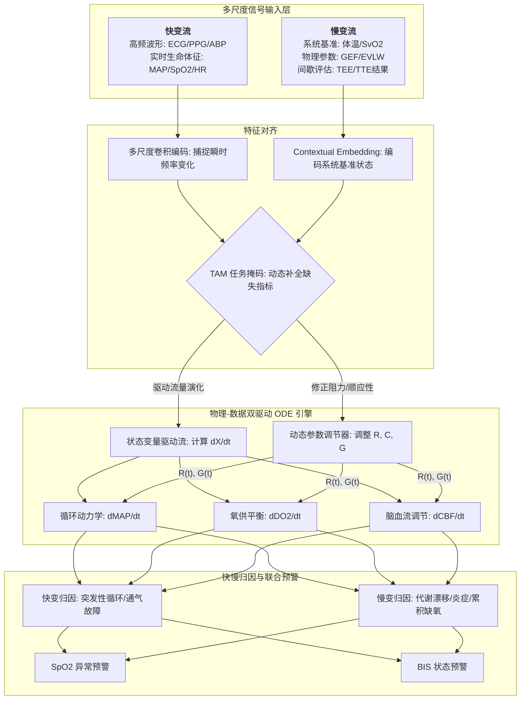
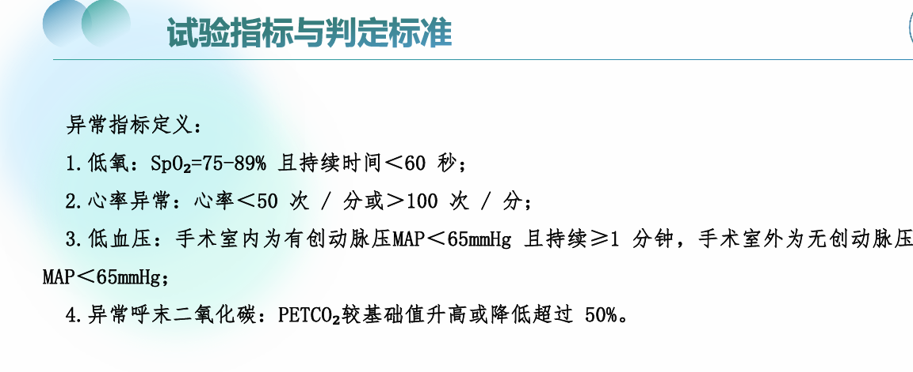

<!-- # 血流动力学 - 氧合 - 脑功能系统关系

## 1. 体循环模块（循环动力学）
- **抽象变量**
  - Drive (D)：心脏泵血动力
  - Volume (V)：容量状态/血容量
  - Flow (Q)：灌注输出量
  - Responsiveness (R)：动力-容量敏感性 / 共轭变化率

- **关系方程**
  - Q = f(D, V)
  - R_D = ∂Q/∂D
  - R_V = ∂Q/∂V
  - dQ/dt = g(D(t), V(t)) （可选时间动态）

- **可观测代理**
  - D：MAP, ARTm
  - V：CVP, SVV, 血容量指数
  - Q：CO, EtCO₂
  - R_V：SVV

---

## 2. 氧合模块（血液/气体交换）
- **抽象变量**
  - Oxygen (O₂)：血氧水平
  - CO₂：通气效率
  - Saturation (S)：血液/组织氧饱和度
  - Oxygen Responsiveness (R_O)：氧合对灌注敏感性

- **关系方程**
  - O₂ = h(Q, Ventilation)
  - CO₂ = k(Q, Ventilation)
  - S = s(O₂)
  - R_O = ∂S/∂Q

- **可观测代理**
  - O₂：SpO₂, rSO₂
  - CO₂：EtCO₂
  - S：血气分析, 非侵入式 SpO₂
  - R_O：ΔSpO₂/ΔQ, ΔrSO₂/ΔQ

---

## 3. 脑功能模块
- **抽象变量**
  - Cerebral Perfusion (C)：脑灌注水平
  - Brain State (B)：脑功能活性/意识状态
  - Brain Responsiveness (R_B)：脑功能对灌注/氧合敏感性

- **关系方程**
  - C = m(Q, S)
  - B = n(C, O₂)
  - R_B = ∂B/∂C 或 ∂B/∂O₂

- **可观测代理**
  - C：rSO₂
  - B：BIS
  - R_B：ΔrSO₂/ΔQ, ΔBIS/ΔO₂

---

## 4. 系统耦合总结
1. 体循环 → 氧合 → 脑功能  
2. 响应量/共轭量 R, R_O, R_B 描述每层对输入变化的敏感性  
3. 可映射到实际观测指标，用于建模或特征工程  

---

## 5. 全部关系方程概览
\[
\begin{cases}
Q = f(D, V) \\
R_D = \frac{\partial Q}{\partial D},\quad R_V = \frac{\partial Q}{\partial V} \\
dQ/dt = g(D(t), V(t)) \\
O_2 = h(Q, \text{Ventilation}) \\
CO_2 = k(Q, \text{Ventilation}) \\
S = s(O_2) \\
R_O = \frac{\partial S}{\partial Q} \\
C = m(Q, S) \\
B = n(C, O_2) \\
R_B = \frac{\partial B}{\partial C},\quad \frac{\partial B}{\partial O_2}
\end{cases}
\]

> 注：对偶/共轭量可理解为敏感性指标，既可以作为响应量，也可以在辛结构或共轭分析中使用。 -->

# 生理动力学模型概览与推荐三元组

---

## 1. 体循环模块
**核心：血压-流量-阻力的动力学建模**

| 模型类型 | 代表名称 | 核心特点 | 适用场景 |
|---------|---------|---------|---------|
| 0D集中参数模型 | 三/四元件 Windkessel（弹性腔）模型 | 方程极简，隐变量为血管顺应性、外周阻力；计算量极低 | 手术室实时监测、设备端轻量化部署 |
| 1D分布式模型 | Toro血管网络 PDE 模型 | 考虑血管截面积的空间分布，用连续性方程 + 动量方程描述血流时空演化；精度高但算力消耗大 | 高精度血流仿真、科研级血管动力学分析 |
| 3D流体力学模型 | 基于 CT/MRI 的血管有限元模型 | 结合患者个体化血管解剖结构，用 Navier-Stokes 方程建模；最精准但无法实时 | 术前手术规划、特定血管病变机理研究 |

---

## 2. 氧输送-代谢模块
**核心：氧供-氧耗的耦合建模**

| 模型类型 | 代表名称 | 核心特点 | 适用场景 |
|---------|---------|---------|---------|
| 宏观氧平衡模型 | Vafaee 氧代谢耦合模型 | 核心方程；隐变量为氧代谢耦合系数；直接关联体循环与组织氧供 | 术中氧灌注监测、个性化氧供阈值计算 |
| 微观氧扩散模型 | Krogh 组织氧扩散模型 | 考虑毛细血管-组织的氧浓度梯度，用扩散方程描述氧传递；参数多、依赖组织解剖 | 器官氧代谢机理研究、缺氧损伤机制分析 |
| 机器学习黑箱模型 | 基于 rSO₂/SpO₂ 的端到端模型 | 直接拟合观测值到氧输送量；无需机理约束但泛化性差 | 无专用设备时的应急估算 |

---

## 3. 脑功能-血流调节模块
**核心：脑血流自动调节 (AR) 建模**

| 模型类型 | 代表名称 | 核心特点 | 适用场景 |
|---------|---------|---------|---------|
| ARD 四室模型 | Ursino 脑血流自动调节模型 | 核心方程；隐变量为调节增益；兼顾脑血流与代谢耦合 | 术中脑灌注稳定性监测、自适应血压阈值计算 |
| 线性传递函数模型 | Tiecks AR 传递函数模型 | 将脑血流自动调节视为“血压输入 → 血流输出”的线性系统；参数少但无法描述非线性饱和特性 | 脑血流调节能力快速评估 |
| 神经-血流耦合模型 | Raichle BOLD-fMRI 耦合模型 | 关联神经元电活动与脑血流、血氧变化；依赖 fMRI 数据 | 脑功能成像研究、神经活动-灌注关联分析 |

---

## 二、最优三元组模型组合
**优先推荐：手术室实时监测 + 机理约束**

**推荐组合：**  
`Windkessel 弹性腔模型（体循环） + Vafaee 氧代谢耦合模型（氧合） + Ursino ARD 四室模型（脑功能）`

### 1. 核心优势
- **方程简洁且耦合性强**：三个模型均为 ODE，可直接联立成耦合方程组，隐变量仅为  
  `C`（血管顺应性）、`k`（氧代谢耦合系数）、`G`（脑血流调节增益），数值反演难度低。  
- **算力适配临床实时性**：无空间分布项，仅需术中实时采集的 MAP、CO、rSO₂ 数据，设备端单片机/嵌入式芯片即可完成秒级计算。  
- **机理完备性高**：三个模型均基于生理守恒律，反演隐变量有明确医学意义，方便临床理解与采信。

### 2. 取舍原因
- **放弃 1D/3D 体循环模型**：算力成本过高，无法满足术中实时性。  
- **放弃微观氧扩散/神经耦合模型**：依赖专用影像学设备，术中无法获取参数。  
- **放弃黑箱 ML 模型**：缺乏机理约束，隐变量无物理意义，难以支撑自适应阈值的个体化调整。

### 3. 耦合方程组框架

\[
\begin{cases}
C \frac{dMAP}{dt} + \frac{MAP}{R} = CO - Q_{out} & (\text{Windkessel}) \\
\frac{dDO_2}{dt} = k \cdot (VO_2 - DO_2) + \alpha \cdot \frac{dMAP}{dt} & (\text{Vafaee}) \\
\frac{dCBF}{dt} = G \cdot \frac{dMAP}{dt} + \beta \cdot \frac{dCMRO_2}{dt} & (\text{Ursino})
\end{cases}
\]

> 其中：  
> - `DO₂ = CO × CaO₂ × 10` 与 CO 直接关联  
> - `CMRO₂` 与 CBF 关联，实现三模块闭环耦合

---
# 围术期因果推断建模：微分方程组与数据映射

---

## 1. 动力学框架
基于 **Windkessel-Vafaee-Ursino** 耦合模型：

- **方程 I (循环)**:  
\[
C \frac{dMAP}{dt} + \frac{MAP}{R} = CO - Q_{out}
\]

- **方程 II (氧供)**:  
\[
\frac{dDO_2}{dt} = k(VO_2 - DO_2) + \alpha \frac{dMAP}{dt}
\]

- **方程 III (脑代谢)**:  
\[
\frac{dCBF}{dt} = G \frac{dMAP}{dt} + \beta \frac{dCMRO_2}{dt}
\]

---

## 2. 方程变量映射表

| 方程变量 | 物理定义 | 采集项编号 / 来源 | 方程角色 / 备注 |
| :--- | :--- | :--- | :--- |
| **$MAP$** | 平均动脉压 | 163 / 67 (PiCCO/ART) | 循环方程主状态量，驱动血流变化 |
| **$CO$** | 心输出量 | 衍生 (129 SVV, 137 GEF, HR×SV) | 循环方程输入流量，决定氧供总量 |
| **$R$** | 外周阻力 | 161 / 162 | 循环方程隐参数，通过 MAP/CO 推导 |
| **$Q_{out}$** | 外周血流输出 | 衍生计算 | 循环方程闭环输出变量 |
| **$C$** | 血管顺应性 | — | 循环方程隐参数，决定 MAP 对血流的弹性响应 |
| **$DO_2$** | 全身氧供 | 188 SpO₂ | 氧供方程主状态变量，依赖 CO × CaO₂ |
| **$VO_2$** | 全身氧耗 | 130 SvO₂ | 氧供方程隐变量，反映组织取氧量 |
| **$k$** | 氧代谢耦合系数 | — | 氧供方程隐参数，调节 DO₂ 对 VO₂ 的响应 |
| **$CBF$** | 脑血流量 | 434 / 112 (BIS / ETCO₂) | 脑代谢方程主状态量，受 MAP 和 CMRO₂ 调控 |
| **$CMRO_2$** | 脑氧代谢率 | 434 BIS | 脑代谢方程隐变量，脑电活动代理脑代谢 |
| **$G$** | 脑血管调节增益 | 112 ETCO₂ | 脑代谢方程参数，CO₂ 影响脑血管舒缩 |
| **$\alpha, \beta$** | 耦合增益系数 | — | 分别调节 DO₂ 对 MAP 和 CBF 对 CMRO₂ 的响应 |

---

## 3. 数据采集字典 (观测项分类)

### 类别一：全身循环动力学
| 编号 | 项目名称 | 单位 | 建模意义 |
| :--- | :--- | :--- | :--- |
| 163 / 51 / 67 | 动脉平均压 (MAP) | mmHg | 核心状态量，驱动脑灌注压力 |
| 161 / 49 / 65 | 动脉收缩压 (SBP) | mmHg | 评估左心室收缩功能 |
| 162 / 50 / 66 | 动脉舒张压 (DBP) | mmHg | 决定冠状动脉灌注压 |
| 89 / 90 / 91 | 无创血压 (NIBP) | mmHg | 校准或信号丢失时补充 |
| 129 | SVV (每搏输出量变异) | % | 容量状态评估，指导液体反应 |
| 137 | GEF (全心射血分数) | % | 收缩力参数，估算 CO 基准 |

### 类别二：氧供与通气代谢
| 编号 | 项目名称 | 单位 | 建模意义 |
| :--- | :--- | :--- | :--- |
| 188 | SpO₂ | % | 核心观测量，反映外周动脉氧含量 |
| 130 | SvO₂ | % | 氧需评估，反映组织氧供需平衡 |
| 112 | ETCO₂ | mmHg | 脑血管调节因子，影响 CBF |
| 1196 | FiO₂ | % | 干预变量，控制氧供输入 |
| 1192 | etO₂ | % | 评估肺部氧合效率 |
| 92 / 217 | 呼吸频率 / 潮气量 | bpm / ml | 驱动 ETCO₂ 变化，影响脑血流 |

### 类别三：脑功能与神经电生理
| 编号 | 项目名称 | 单位 | 建模意义 |
| :--- | :--- | :--- | :--- |
| 434 | BIS | - | 核心观测量，代理脑代谢率 CMRO₂ |
| 建议补 | rSO₂ | % | 中介变量，连接 SpO₂ 与脑血氧 |

### 类别四：心脏电生理与环境背景
| 编号 | 项目名称 | 单位 | 建模意义 |
| :--- | :--- | :--- | :--- |
| 40 / 44 | HR / 脉率 | bpm | 决定 CO，辅助 SQI 校验 |
| 189-191 | ST 段 (I, II, III) | mm | 心肌缺血监测，识别 CO 突降诱因 |
| 100 / 104 | 体温 / 鼻温 | ℃ | 校准代谢率 VO₂ 与 CMRO₂ |
| 71 | CVP | mmHg | 回流背景项，计算有效灌注压 |
| 77 | PAs | mmHg | 评估右心负荷及肺血管阻力 |

### 类别五：容量与间质积液
| 编号 | 项目名称 | 单位 | 建模意义 |
| :--- | :--- | :--- | :--- |
| 140 / 142 | EVLW / EVLWI | ml | 血管外肺水，反映肺水肿风险 |
| 141 / 143 | ITBV / ITBVI | ml | 胸腔内血容量，评估系统容量状态 |

---

## 4. 建模启示 

1. **因果流向示意**
   - `ETCO₂` → 脑血管阻力 → `BIS`
   - `MAP` → 脑灌注 → `BIS`
   - `SpO₂` → $CaO_2$ → 全身氧供 → `BIS`

2. **异常检测逻辑**
   - $MAP$ 稳定且 $SpO₂$ 稳定，但 $BIS$ 异常 → 检查 ETCO₂ 或麻醉干预。
   - $SvO₂$ 持续下降 → 提前预警 DO₂ 无法覆盖 VO₂。

3. **特征融合建议**
   - 类别四（心脏/体温）可作为静态/条件特征。
   - 类别一（循环）+ 类别二（氧合）作为动态输入，预测类别三（BIS/rSO₂）。

4. **信号质量控制 (SQI)**
   - 利用 SVV / HR 与脉率一致性自动识别噪声或异常采集信号。

5. **隐变量反演**
   - CO 可结合 GEF、SVV、HR 子网络或物理算子估算，用于微分方程驱动力。
  
6. **干预变量**
   - 在实际建模时，由于手术中会给药（麻醉药、血管活性药），方程中的参数（如 k,α,β）不应该是常数，而应该是受给药剂量和时间标签驱动的动态函数。
  

**Remark1.** EtCO2异常状态界定尚未明朗
**Remark2.** 主要关注体循环、氧合的EtCO2、SpO2、HR、BP。脑氧数据很少。
**Remark3.** 注意异常值清洗。
**Remark4.** 等跑通了再要新的数据。