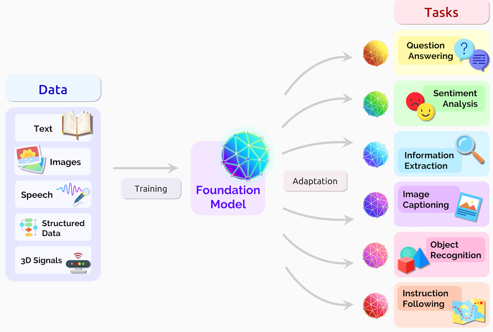
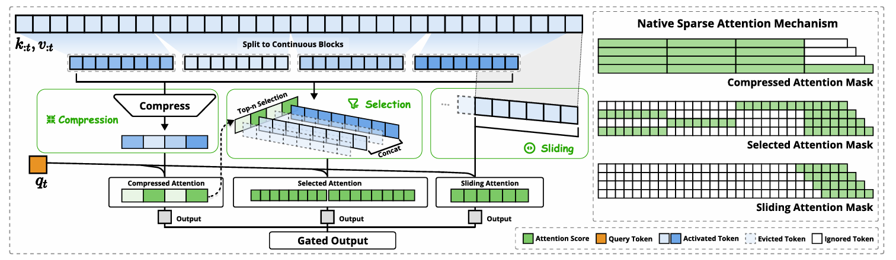
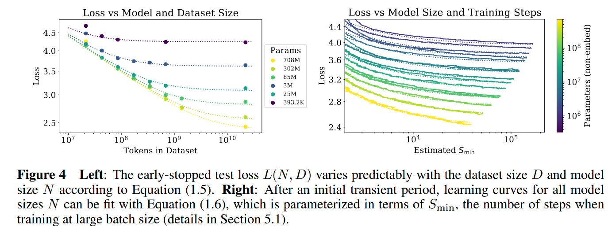
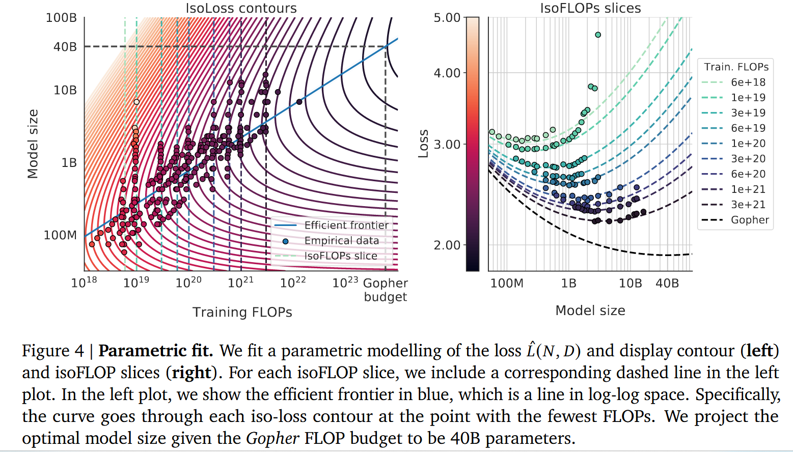
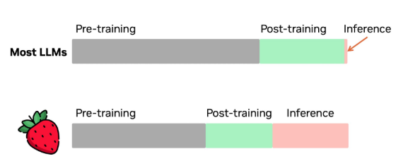
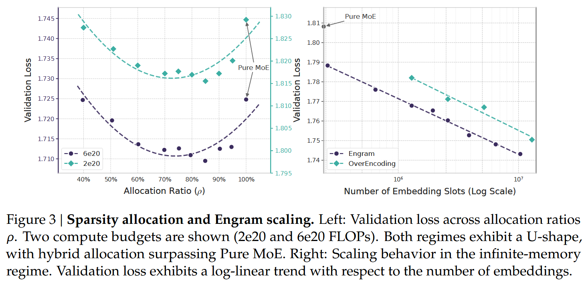

<blockquote class="cover-page">
  
基本模型

  <blockquote class="cover-subtitle">
   无监督生成，监督微调与偏好强化学习
  </blockquote>

<blockquote class="figure">

[*On the Opportunities and Risks of
Foundation Models*](https://arxiv.org/pdf/2108.07258)
</blockquote>

  

Igza Vit

2026.1.13

  

</blockquote>

  <h1>Contents</h1>
  

<blockquote class="preface">

# 序言
  <blockquote class="discussion">
  
在开始之前，我们不妨先抛出几个问题：
1.我们应如何理解Token Embedding(词的表示)的意义。具体到一个深层Transformer模型，$X$的行向量与$Q,K,V$的行向量，谁是坐标向量，谁是切向量，谁又是余切向量，信息是被从什么空间搬运到什么空间的。
2.Normalization仅仅是为了数值稳定吗，还是作为一个球面投影操作，构造了一个语义商空间？
3.我们该如何看待监督微调这一削足适履的过程，避免泛化受损的关键因素是什么？或者说，为什么增加一些无监督阶段的数据能够保持一定的泛化能力？

</blockquote>

  
对于上述问题我们不妨先给出一些初步的猜测，后续再循序渐进地修正我们的想法：
- Token Embedding可以被看作一个完整的向量，也可以是一个被展平的向量组(MHA，子空间直和),又或者仅仅一个毫无结构的线性空间元素(没有内积和范数)。
- 不妨假设我们的Token Embedding是某种形式的坐标向量,那么$W_K,W_Q,W_V$实际上定义了**坐标标架**到**切丛纤维标架**的变换，而$Q$是**切向量**，$K,V$是**余切向量**，注意力得分是**联络系数**。序列方向上，路径点之间在进行信息交换；沿着网络深度方向，整个语义路径在做收缩变换。在这一观点下，HC的超特征残差实际上承担着**标架信息**在网络深度方向上的显式传递，后文可以作为一个例子进行讨论。通常数据流形被我们嵌入到了一个过分高维的坐标空间中，因此我们还需要注意其切丛纤维该如何恰当定义。
- Normalization方法如RMSNrom可以看作路径生长后的商化。我们
- 不妨想象自回归是从某个起点开始不断头尾相接切向量(序列方向)：假设它们是非闭合的，那么我们可以将它们生长的某个状态位置对应到球面元素，作为语义等价类的分配；如果他们的极限行为是回到原点(随机向量均值为0)，那么我们可以考虑它们的路径同伦是否会遇到拓扑障碍，这些孔洞就是我们要挖掘的语义生成元(我们应当区分语义生成元和Token的概念，后者为了独占是允许冗余的，也即词量往往比特征空间维度大得多)。
- 对于监督微调，在生成式建模的笔记里有相应的讨论，这里也会再进行强调。
<blockquote class="figure">

</blockquote>

- 一个补充：连续时间t可以根据多尺度分析层数$d$转换为d维环面$T^d$上的元素，我们构造了一个具有循环结构的底空间；在稀疏注意力[[*Native Sparse Attention,2025*](https://arxiv.org/pdf/2502.11089v1)]中，也有类似的思想，将序列位置p从整数模变换为类似3维环面但仅取离散点的结构，可以抽象为**静态多尺度注意力**的概念。（备注，文中的Continous block 应当改成Contiguous block更恰当，因为是离散结构）

</blockquote>
<blockquote class="chapter">
  
# 代数补充
<blockquote class="section">

## 线性空间
<blockquote class="definition">

**线性空间**
给定一个域$(K,+,\cdot)$记为$\mathbb{K}$,一个交换群$(X,+)$,$V:=(X,\mathbb{K},\circ)$是一个$\mathbb{K}$-线性空间，如果满足
$$
\circ :K\times X\rightarrow X,\forall r,s\in K,a,b \in X \\
\begin{align}
左右分配律&:& r\circ (a+b)=(r\circ a)+(r\circ b)&,(a+b)\circ r=(r\circ a)+(r\circ b)\\
结合律&:&r\circ(s\circ a)&=(r\cdot s)\circ a\\
单位公理&:&1\circ a &=a
\end{align}$$
</blockquote>
<blockquote class="example">

$(K,\mathbb{K},\cdot)\cong\mathbb{K}$是一个$\mathbb{K}$-线性空间。
</blockquote>
<blockquote class="definition">
  
**线性子空间**
设$V:=(K,+,\circ)$是$\mathbb{K}$-线性空间,有子集$D\subset X$,$(D,\mathbb{K},\circ)$是$V$的线性子空间，如果满足：
$$\forall r\in K,d\in D,r\circ d\in D$$
</blockquote>
<blockquote class="definition">

**$\mathbb{K}$-代数**
给定$\mathbb{K}$-线性空间$V:=(X,\mathbb{K},\circ)$，V成为$\mathbb{K}$-代数，如果交换群能构成环$(X,+,\times_X)$，$\times_X :X\times X\rightarrow X$，且满足标量乘法相容性：
$$r\circ(a\times_X b)=(r\circ a)b=a\times_X(r\circ b)$$$\mathbb{K}$-代数的交换性、结合性来自环$(X,+,\times_X)$
</blockquote>
<blockquote class="example">

$(K,\mathbb{K},\cdot)\cong\mathbb{K}$是一个$\mathbb{K}$-代数。

</blockquote>
<blockquote class="definition">

**基**  

设 \(V\) 是一个域 \(\mathbb{K}\) 上的线性空间。一个向量族  
\[
\mathcal{B} = \{ e_1, e_2, \dots, e_n \} \subset V
\]  
称为 \(V\) 的一组**基（basis）**，如果满足：

1. **线性无关（Linear independence）**  
\[
\sum_{i=1}^n a_i e_i = 0 \quad \Rightarrow \quad a_1 = \cdots = a_n = 0
\]

1. **张成性（Spanning）**  
对任意 \(x \in V\)，存在唯一的标量 \(a_1,\dots,a_n \in \mathbb{K}\)，使得
\[
x = \sum_{i=1}^n a_i e_i
\]

此时称 \(\mathcal{B}\) 是 \(V\) 的一组基，$\set{a_i}$构成关于这个基的坐标。

</blockquote>

</blockquote>
<blockquote class="section">

## 算子
<blockquote class="definition">

**算子与泛函**
给定两个任意的$\mathbb{K}$-线性空间$V,W$，
任意映射$T:V\rightarrow W$是一个算子。
如果$W=(K,K,\cdot)$,T是一个泛函。

</blockquote>

<blockquote class="definition">

**线性算子与线性泛函**
算子（泛函）$T:V\rightarrow W$是一个线性算子（泛函），如果:
$$\forall x,y\in V,a,b\in K,T(ax+by)=aT(x)+bT(y)$$
</blockquote>
<blockquote class="lemma">

$T:V\rightarrow W$是一个线性算子(泛函)，任意线性子空间$D\subset V$，有$T_D:=T|_D:D\rightarrow W$是一个线性算子（泛函）
</blockquote>

<blockquote class="theorem">

**Riesz表示定理**
</blockquote>
</blockquote>

<blockquote class="section">

## 内积空间
现在，我们有了一个$\mathbb{K}$-线性空间$V=(X,\mathbb{K},\circ)$,我们可以定义$X$中元素在标量域$\mathbb{K}$元素作用下的线性组合，但是我们无法比较$X$中元素之间的关系，因此我们至少要构造一种映射，把两个元素之间的关系拉回到标量域上上；我们甚至也可以构造一种多线性映射来描述元素的多对多关系。
内积的动机就是构造积空间上的一种特殊的线性泛函，由此诱导出元素之间的几何量如夹角、长度、距离等。
<blockquote class="definition">

**内积**
$\mathbb{K}$-线性空间$V=(X,\mathbb{K},\circ)$的元素即它的Abel群$X$中的元素。
一个映射$$\langle \cdot,\cdot \rangle:V\times V\rightarrow\mathbb{K}$$称为内积，如果$\forall x,y,z\in V,a,b\in\mathbb{K}$满足：$$\begin{align}
&共轭对称& \langle x,y \rangle&=\overline{\langle y,x \rangle}\\
&线性性&  \langle ax+by,z \rangle&=a\langle x,z \rangle+b\langle y,z \rangle\\
&正定性&  \langle x,x \rangle\ge 0,\langle x,x \rangle&=0\Leftrightarrow
 x=0
\end{align}$$$(V,\langle \cdot,\cdot \rangle)$称为内积空间。
</blockquote>
<blockquote class="remark">

内积允许我们定义正交性、范数和距离：$$\begin{align*}
x\perp y&\Leftrightarrow \langle x,y\rangle=0\\
\|x\|:&=\sqrt{\langle x,x\rangle}\\
d(x,y):&=\|x-y\|\end{align*}$$
</blockquote>

<blockquote class="example">
  
**实内积空间**
当标量域为实数域，也即一个$\mathbb{R}$-线性空间$V=(X,\mathbb{R},\circ)$,通常Abel群$X$取$(\mathbb{R}^n,+)$,此时标量作用$\circ$变成逐维度域乘法。
一个映射$$\langle \cdot,\cdot \rangle:V\times V\rightarrow\mathbb{R}$$是实内积，$(V,\langle \cdot,\cdot \rangle)$是实内积空间，如果$\forall x,y,z\in V,a,b\in\mathbb{R}$满足：$$\begin{align}
&对称性& \langle x,y \rangle&={\langle y,x \rangle}\\
&双线性&  \langle ax+by,z \rangle=a\langle x,z \rangle+b\langle y,z \rangle,&\langle x,ay+bz \rangle=a\langle x,y \rangle+b\langle x,z \rangle\\
&正定性&  \langle x,x \rangle\ge 0,\langle x,x \rangle&=0\Leftrightarrow
 x=0
\end{align}$$有限维实线性空间上的内积是对称正定方阵的二次型,实对称矩阵可正交对角化$M=Q^T\Lambda Q$,任意实内积都可以通过旋转、伸缩以通过可逆变换，$$\langle x,y \rangle_{M}=x^TMy=(\Lambda^{\frac{1}{2}}Qx)^T(\Lambda^{\frac{1}{2}}Qy)$$化为标准实内积，也即欧式内积$$\langle x,y \rangle_{M}=\langle \Lambda^{\frac{1}{2}}Qx,\Lambda^{\frac{1}{2}}Qy \rangle_{\mathbb{E}}$$
</blockquote>
<blockquote class="example">

**复内积空间**
同理，对于$\mathbb{C}$-线性空间$V$,
一个映射$$\langle \cdot,\cdot \rangle:V\times V\rightarrow\mathbb{C}$$是复内积，$(V,\langle \cdot,\cdot \rangle)$是复内积空间，如果$\forall x,y,z\in V,a,b\in\mathbb{C}$满足：$$\begin{align}
&共轭对称& \langle x,y \rangle&=\overline{\langle y,x \rangle}\\
&半线性&  \langle ax+by,z \rangle=a\langle x,z \rangle+b\langle y,z \rangle,&\langle x,ay+bz \rangle=\bar{a}\langle x,y \rangle+\bar{b}\langle x,z \rangle\\
&正定性&  \langle x,x \rangle\ge 0,\langle x,x \rangle&=0\Leftrightarrow
 x=0
\end{align}$$相应地，有限维复线性空间上地内积是厄米(Hermitian)正定矩阵的二次型，复厄米矩阵可以幺正对角化，或者说酉(Unitary)对角化$A=U^{\dagger}\Lambda U$,任意复内积也能通过可逆线性变换$$\langle x,y \rangle_{A}=x^{\dagger}Ay=(\Lambda^{\frac{1}{2}}Ux)^{\dagger}(\Lambda^{\frac{1}{2}}Uy)$$化为标准复内积，$$\langle x,y \rangle_{A}=\langle \Lambda^{\frac{1}{2}}Ux,\Lambda^{\frac{1}{2}}Uy \rangle_{\mathbb{C}}$$

</blockquote>

现在，我们来看看这两种空间的关系。
<blockquote class="theorem">

**Kähler结构**
由于$$\bigoplus^{2m} \mathbb{R}\cong\bigoplus^{m}\mathbb{C},z=a+bi\leftrightarrow (a,b)$$我们记这个同构的投影映射为$P:\mathbb{C}^{m}\rightarrow \mathbb{R}^{2m}$，满足$$P(u+v)=P(u)+P(v)$$设$(V,\langle \cdot,\cdot \rangle_{\mathbb{R}})$是$2m$维实内积空间，$\forall x,y\in V$若存在线性算子$$J:V\rightarrow V$$满足$J^2=-I,\langle Jx,Jy \rangle_{\mathbb{R}}=\langle x,y \rangle_{\mathbb{R}}$
则$V$可以视作一个$m$维复向量空间，且配备复内积$$\langle P^{-1}(x),P^{-1}(y) \rangle_{\mathbb{C}}:=\langle x,y \rangle_{\mathbb{R}}+i\langle Jx,y \rangle_{\mathbb{R}}$$

</blockquote>
<blockquote class="proof">

证明略
</blockquote>
<blockquote class="example">

$V:=(\mathbb{R}^{2m},\langle \cdot,\cdot \rangle_{\mathbb{R}}),U:=(\mathbb{C}^{m},\langle \cdot,\cdot \rangle_{\mathbb{C}})$，取欧式内积，有$$\begin{align*}
  J=\begin{pmatrix}
0 & -I_m \\
I_m & 0
\end{pmatrix},&J^2=-I_{2m},J^TJ=I_{2m}\\
\forall x,y\in V,&x^TJ^TJy=x^Ty
\end{align*}$$实际上对于任意正定对称矩阵$M$，令$J_M^TMJ_M=M$，通过Cholesky分解$M=L^TL$，可得到$$J_M=L^{-1}JL,$$相容性成立。
</blockquote>
<blockquote class="proposal">

**序列元素向量的Kähler结构**

对于$\forall x,y\in (\mathbb{R}^{2m},\langle \cdot,\cdot\rangle_{\mathbb{E}},J_{\mathbb{E}})$，其中$J_{\mathbb{E}}$是使得欧式内积与标准复内积相容的辛结构，
简记$u=P^{-1}(x),v=P^{-1}(y)$根据定理1.3.1，
$$\langle x,y\rangle_{\mathbb{E}}=\langle u,v\rangle_{\mathbb{C}}-i\langle Jx,y\rangle_{\mathbb{E}}$$也即$$x^Ty=u^{\dagger}v-i\cdot P(u)^TJ^TP(v)$$从而加性位置编码与乘性位置编码的表示形式如下$$\begin{align}
  x\rightarrow P(P^{-1}(x)+s_x)\\
  x\rightarrow P(s_x\odot P^{-1}(x))
\end{align}$$
对实内积影响为如下**仿射性扰动**和**权重重标定形式**$$\begin{align}
  d\langle x,y\rangle_{\mathbb{E}}=\real[s_x^{\dagger}s_y+s_x^{\dagger}v+u^{\dagger}s_y]\\
d\langle x,y\rangle_{\mathbb{E}}=\real[\sum_j(\overline{s_{x,j}}s_{y,j}-1)\overline{u_j}v_j]
\end{align}$$
</blockquote>

</blockquote>

<blockquote class="section">

## 傅里叶分解与拉普拉斯分解

<blockquote class="definition">

**连续傅里叶分解(Continuous Fourier Decomposition)**
取$\mathbb{R}$的非平凡连通闭子集$I=[a,b]$，定义在其上的实值函数组成的所有形如$$f(t)=r(t)e^{i\theta(t)}$$的平方可积函数构成一个无限维Hilbert空间$L^2(I,\mathbb{C})$，$f,g\in L^2(I,\mathbb{C})$有复内积$$\langle f,g \rangle_{L^2}:=\int_{a}^{b} f(t)\overline{g(t)}dt,$$我们试图为$L^2(I,\mathbb{C})$构造一组标准正交基从而唯一表示其中任意元素，考虑一个无限维多项式$$\begin{align*}
  \phi_{\omega}(t):=e^{i\omega t}=\sum_{n\in \mathbb{N}}\frac{(i\omega t)^n}{n!}&=\cos {\omega t}+i \cdot \sin {\omega t}\\
  d \phi_{\omega}=& \phi_{\omega}(t)\cdot dt
\end{align*}$$有$$\langle \phi_{\omega_1},\phi_{\omega_2} \rangle_{L^2}=\int_{a}^{b} e^{i(\omega_1-\omega_2)t}dt=\begin{cases}
  b-a,\Delta\omega =0\\
  \frac{e^{i\Delta\omega b}-e^{i\Delta\omega a}}{i\cdot \Delta\omega},\Delta\omega \ne 0
\end{cases}$$其中$\Delta\omega=\omega_1-\omega_2$，从而$$\begin{align}
  \|\phi_\omega\|_{L^2}&=\sqrt{\langle \phi_{\omega},\phi_{\omega} \rangle_{L^2}}=\sqrt{b-a}\\
\langle \phi_{\omega_1},\phi_{\omega_2} \rangle_{L^2}=0&\Leftrightarrow (b-a)\cdot \Delta\omega\in 2\pi\cdot \mathbb{Z}\setminus\set{0}
\end{align}$$由此我们得到了$L^2(I,\mathbb{C})$的标准正交基$$\Phi:=\set{\frac{1}{\sqrt{b-a}}\cdot\phi_{\omega_j}|j\in \mathbb{Z},\omega_j=\frac{2\pi}{b-a}\cdot j},$$从而$L^2(I,\mathbb{C})=Span(\Phi),$简记$\phi_{\omega_j}$为$\phi_j$，则$\forall f\in L^2(I,\mathbb{C}),$$$f=\sum_{j\in\mathbb{Z}}\langle f,\phi_j \rangle_{L^2}\cdot \phi_j,$$其中$\langle f,\phi_j \rangle_{L^2}$即为我们熟知的频域系数,频率到频域系数的映射$F(\omega)$即所谓的特征函数，该方法为信号之间的比较提供了一个标尺。
</blockquote>

<blockquote class="definition">

**离散傅里叶分解(Discrete Fourier Decomposition)**
当支集退化为离散点集时，我们仍然可以用类似的思路去构造分解结构。
考虑一个有限大小的离散点集$\mathbb{Z}_N$，对于$\forall f,g\in \mathbb{C}^{\mathbb{Z}_N}$,我们定义一种内积
$$\langle f,g\rangle:=\sum_{t=0}^{N-1}f(t)\overline{g(t)}$$
</blockquote>
</blockquote>

<blockquote class="section">

## 差分等变内积编码
<blockquote class="proposal">

给定一个$m$维复内积空间$\mathbb{C}^m$,构造映射$$\Phi:\mathbb{R}\rightarrow \mathbb{C}^m$$若存在映射$K:\mathbb{R}\rightarrow \mathbb{C}$使得$\forall q_1,q_2\in\mathbb{R},$$$\langle \Phi(q_1),\Phi(q_2)\rangle_{\mathbb{C}}=K(q_1-q_2)$$则称$\Phi$是一种差分等变内积编码。
</blockquote>

<blockquote class="theorem">
  
**Bochner's theorem**
一个函数$K(\Delta)$是平移不变的正定核，当且仅当它可以表示为$$K(\Delta)=\int_{\mathbb{R}}e^{i\omega \Delta}d\mu(\omega),$$其中$\mu$是非负测度。
</blockquote>
<blockquote class="proof">

证明略。
</blockquote>
<blockquote class="example">

**傅里叶位置编码**
令$$\Phi(q)=(e^{i\omega_1 q},...,e^{i\omega_mq})$$则$$\langle \Phi(q_1),\Phi(q_2)\rangle_{\mathbb{C}}=\sum_{k=1}^m$$
</blockquote>

</blockquote>

</blockquote>

<blockquote class="chapter">

# 表示系统
这一章节将介绍一些，特别是以自然语言为例，关于实体的构建与实体的表示方法，也即Tokenization与Token Embedding。

<blockquote class="section">

## Tokenization
Tokenization的一个恰当翻译是“令牌化”，也即Token作为一种编码，是用于唯一识别**某一粒度下的**实体的。对于自然语言，很容易想为语料库中所有字符元素构建一个索引表，我们可以用他们的排列组合去编码任意语言序列了。
然而，作为语言模型开端的开端，编码是需要服务于下游的语义建模的模型的。我们说一种编码方案是匮乏的，如果它在实体库中的平均编码长度与其方差很大；一种编码方案是臃肿的，如果它的码元数量过分地多。我们想要的是一种紧致的编码方案，它是编码长度分布恰当性与码元数量的折中。

直觉上来说，这好像可以被定义为一个拓扑空间上的演化。
<blockquote class="definition">
  
  给定一个元素是变长序对的语料库$\mathcal{C}:=\set{s_1,s_2,...,s_{|\mathcal{C}|}}$和$\mathcal{C}$中最小元素集合$\mathcal{A}$，也即$\mathcal{A}$中元素是字母、数字、制表符等。
  现在考虑$\mathcal{A}$上的拓扑$\mathcal{T}$，满足：
  $$\begin{align}
& \varnothing \in \mathcal{T}, \quad \mathcal{A} \in \mathcal{T}, \\
& \bigcup_{U \in \mathcal{I}} U \in \mathcal{T}, \quad \forall \mathcal{I} \subseteq \mathcal{T}, \\
& \bigcap_{i=1}^{n} U_i \in \mathcal{T}, \quad \forall U_1, \dots, U_n \in \mathcal{T}, \; n \in \mathbb{N}.
\end{align}$$
$(\mathcal{A},\mathcal{T})$称为$\mathcal{A}$上的拓扑空间，$\mathcal{T}$中的元素称为开集，$2^\mathcal{A}-\mathcal{T}$中的元素称为闭集。
</blockquote>

<blockquote class="example">

下面给出两种极端情形下的拓扑
离散拓扑：$\mathcal{T}:=2^{\mathcal{A}}$,相当于我们认为每个符号元素和他们的任意**组合**都有含义。
平凡拓扑：$\mathcal{T}:=\set{\varnothing,\mathcal{A}}$，相当于我们认为所有符号元素和任意**组合**都是**不可分辨**的。
</blockquote>

但实际上我们并不是在改变“什么是开集”，而是在选定一个$\sigma$-代数。
我们可以将 Tokenization 理解为一种结构引入过程：  
从“完全不可分”的表征状态出发（即所有符号仅作为未分化的整体存在），逐步引入可区分的组合单元，使得模型能够在表达能力与编码紧致性之间取得平衡。
在这一意义下，Tokenization 不是简单的编码映射，而是在字符串空间上构造一种**可分解结构**，它规定了哪些子串应被视为语义原子，哪些应被视为可进一步分解的复合体。。

</blockquote>

<blockquote class="section">

## Token Embedding
</blockquote>

</blockquote>

<blockquote class="chapter">

# 位置编码
我们希望Transformer的注意力得分能够感知Token在序列中的位置,**顺便**打破置换不变性，这是自然语言所要求的，数据从集合走向有序元组的必经之路。需要注意的是置换不变性是其次条件，我们真正想要的是感知词元之间的**带强度的时序关系**。
我们考虑序列中第$m,n$个Token，假设我们已经获取了它们内容的嵌入表示坐标向量$c_m,c_n\in C\subset\mathbb{K}^d$,
我们想要知道两个Token的关联程度，实际上是要找到一个合适的$T:C\times C\rightarrow W$，
我们希望结果总是可比的($W$上具有全序)，并且尽量不要重复，最简单的办法是选择$W=(\mathbb{R},\mathbb{R},\circ)\cong\mathbb{R}$
<blockquote class="proposal">

我们有线性投影$$\begin{align*}
  q_i=x_iW_Q，k_i=x_iW_K，v_i=x_iW_V
\end{align*}$$注意此时仅有平凡表示$x_i=c_i$,默认行向量表示。
不妨直接用实内积空间的欧式内积反映Token的交互，注意力得分$\alpha$定义为：
$$\alpha_{i,j}:=\langle q_i,k_j\rangle_{E}=x_iW_QW_K^Tx_j^T$$尽管此时$\alpha_{m,n}=\alpha_{n,m}$需要满足$W:=W_QW_K^T$是一个对称阵，但我们发现对于整个序列模型来说存在成组置换对称性：
$$\alpha_{i,m}+\alpha_{j,n}=\alpha_{m,i}+\alpha_{n,j}$$对于偶数长度的序列，导出的注意力分布是**置换等变**的，相应地，结果是置换不变的；
对于奇数长度序列，尽管结果会受置换影响，但**带权语序信息**仍没有被感知。

</blockquote>
<blockquote class="proposal">

我们想找到一个$P:\mathbb{R}^d\times\mathbb{Z}\rightarrow \mathbb{K}^n$，使得
$$\alpha_{m,n}\propto |m-n|$$
我们知道，复内积空间就能做到$$
  u,v\in\mathbb{C}^T,\langle u,v\rangle_{\mathbb{C}}:=uv^{\dagger}=\sum_j^Tu_j\bar{v_j}=\sum_j^Tr_{uj}r_{vj}e^{i(\theta_{uj}-\theta_{vj})}$$根据$$re^{i\theta}=rcos(\theta)+i\cdot rsin(\theta)
$$我们取实部$$\real[\langle u,v\rangle_{\mathbb{C}}]=\sum_j^Tr_{uj}r_{vj}cos{(\theta_{uj}-\theta_{vj})}$$

因为$\real(\langle u,v\rangle_{\mathbb{C}})$关于$u,v$置换不变,符合相对位置的对称关系。
现在我们考虑两个索引$m,n\in\mathbb{Z}$，为了符号简洁、计算便利，为其分别构造各分量模长为1的复向量$u,v$，不妨令
$$u=(e^{i\cdot m\theta_0},e^{i\cdot m\theta_1},...,e^{i\cdot m\theta_{T-1}}),v=(e^{i\cdot n\theta_0},e^{i\cdot n\theta_1},...,e^{i\cdot n\theta_{T-1}})$$
我们知道加法群$\mathbb{C}^T\cong \mathbb{R}^{2T}$并且有如下性质
$$\langle \cdot,\cdot\rangle_{\mathbb{R}^{2T}}=\real[\langle \cdot,\cdot\rangle_{\mathbb{C}^T}]$$
</blockquote>

<blockquote class="example">

位置编码可以大致归纳为以下形式：
$$\begin{align*}
  x_i=c_i+p_i\\
  x_i=c_iR_i\\
  \\
\end{align*}$$
</blockquote>

</blockquote>

<blockquote class="chapter">

# 生成系统
这一章将简单介绍一下生成式建模的概念，给出一个生成式建模的界定范围。

<blockquote class="section">

## 概率空间
在定义什么是生成建模之前，我们首先重新认识一下我们所讨论的对象究竟是什么。
<blockquote class="definition">

**概率空间**是一个三元组  
\[
(\Omega, \mathcal{F}, \mathbb{P}),
\]
其中：
1. \(\Omega\) 称为**样本空间**，表示所有可能发生的基本事件的集合；
2. \(\mathcal{F}\subseteq 2^{\Omega}\) 称为**事件空间**或 **σ-代数**，其元素称为事件，满足：
   - \(\Omega \in \mathcal{F}\)；
   - 若 \(A \in \mathcal{F}\)，则其补集 \(A^c \in \mathcal{F}\)；
   - 若 \(\{A_i\}_{i=1}^\infty \subset \mathcal{F}\)，则 \(\bigcup_{i=1}^\infty A_i \in \mathcal{F}\)；
3. \(\mathbb{P}: \mathcal{F} \to [0,1]\) 称为**概率测度**，满足：
   - \(\mathbb{P}(\Omega) = 1\)；
   - 若 \(A_i\) 两两不交，则  
     \[
     \mathbb{P}\left(\bigcup_{i=1}^\infty A_i\right) = \sum_{i=1}^\infty \mathbb{P}(A_i).
     \]

</blockquote>

<blockquote class="remark">

从定义上看，概率空间可以概括为：
- 。。。
- 测度可列可加
</blockquote>

<blockquote class="remark">

对应到自然语言的数据场景，我们可以说所有字符单元如字母、数字、符号等，构成了一个样本空间吗？其实不是的。
实际上，语言模型中的样本空间的元素是**任意可能文本序列**，事件空间的元素是我们**可以讨论概率的对象**：“出现一个包含某关键词的序列”、“出现了一段维根特斯坦风格的序列”等等。
</blockquote>
</blockquote>
</blockquote>

<blockquote class="chapter">

# 宏观性能扩张规律

<blockquote class="info">
  
  [$$\mathcal{L}(N,C)\approx K_1N^{-\alpha}+K_2C^{-\beta}+L_{\infty}$$](https://en.wikipedia.org/wiki/Neural_scaling_law)
</blockquote>

Transformer的性能扩张能力强之所以，既归功于其检索型的注意力机制，又归功于它是一种生成式建模。值得一提的是，我们往往只关注这类模型的任务能力，却忽略了其自回归生成的本质。一言以蔽之，“瘦死的骆驼比马大”，我们不该迷信它的能力，而是要想清楚，何种关键因素可以作为我们进一步研究的切入点。
笔者认为，研究Scaling Law的理想是，其能提供一种预先的视界，或者说为低成本的试错背书：在适用Scaling Law的模型范畴内，我们仅需要在小模型上对比出何种构造是更优的，尽管目前还满足不了我们的需求，但至少我们找到了一种性价比较高的方案；其次，它能告诉我们在何种维度上进行扩展提升更大。

<blockquote class="section">

## 资源量扩张下的性能增长规律

本小节讨论的是一种**模型无关**的Scaling Law研究视角，也即仅仅从宏观资源因素上分析该如何扩张语言模型的性能。

一篇来自OpenAI在2020年的工作[[Kaplan et al 2020]](https://arxiv.org/pdf/2001.08361)给出了一个经验公式估计：自回归语言模型的**训练损失**$\mathcal{L}$与模型参数（嵌入前数目）$N$、训练集大小（Token数）$D$以及训练算力(PF-days)$C$的关系

<blockquote class="info">

$$\begin{align}
  &\mathcal{L}(N)\approx (N_c/N)^{\alpha_N},\alpha_N\sim7.6e-2,N_c\sim 8.8e13\\
  &\mathcal{L}(D)\approx (D_c/D)^{\alpha_D},\alpha_D\sim 9.5e-2,D_c\sim 5.4e13\\
  &\mathcal{L}(C_{min})\approx (C_c^{min}/C_{min})^{}\alpha_C^{min},\alpha_C^{min}\sim 5e-2,C_c^{min}\sim 3.1e8
\end{align}$$
</blockquote>
<blockquote class="figure">
  
**早期的Kaplan(2020)主张增加模型大小比增加数据量更重要**
</blockquote>
<blockquote class="figure">

**Chinchilla(2022)主张训练数据也要随着参数量扩张**
</blockquote>

<blockquote class="discussion">

一个可能的疑惑是，对于模型的表现能力，参数量$N$与数据量$D$被纳入考察是容易理解的，为什么算力$C$也作为一个考量因素,难道它不是一个训练/推理速度相关的量吗？
事实上，这里的算力指的是投入的计算成本量，根据[[Kaplan et al 2020]](https://arxiv.org/pdf/2001.08361)中提到的技术公式
$$C\approx 6ND$$也即我们预计付出的算力决定了我们能配置的参数量和数据量之间的关系。
</blockquote>
下面给出几个结论
<blockquote class="warning">
  
- **大参数量模型的样本效率更高**：同样的算力，大参数量-小数据量的性能会比小参数量-大数据量好。
- **参数量-数据量同步扩张带来的性能提升更好**：单单扩大参数量或增加数据量带来的算力开销是相对低效
<blockquote class="figure">

</blockquote>

- **推理侧算力缩放**：增大训练时强化学习的算力投入和推理时给予模型更长思考时间，也能带来性能提升（后半句不适合**低时延需求**场景）[[DeepSeek-R1]](https://arxiv.org/pdf/2501.12948)
</blockquote>

  
</blockquote>

<blockquote class="section">

## 自回归生成与注意力机制的优势

实际上，同为生成式建模，Transformer的自回归生成相比Bert的条件概率族建模有着更大的扩展潜力，也即：并非生成式建模这一简单因素造就了Transformer的“神话”，更重要的是，注意力机制以一种“作弊式的”方案带来了极大的信息利用效率。
需要注意的是，虽然后者相对来说贡献更大，但两者是相辅相成的。
</blockquote>
</blockquote>

<blockquote class="chapter">

# 微观性能扩张规律
本小节讨论的是，在模型实现细节上，何种扩张方式能带来更大的性能增益-开销增量比。
<blockquote class="section">

## 向量丛：底空间，纤维与截面
直观来看，向量丛刻画的是一种“带内部自由度的表示结构”：与其为底空间中的每一个点仅分配一个向量，不如为其分配一个向量空间，从而允许同一语义状态下存在多种并行的表示方式。在这一框架下，所谓“截面”可以理解为一种在每个纤维中选取具体向量的规则。
<blockquote class="definition">

设拓扑空间$B$为底空间，一个纤维丛是三元组 $(\mathcal{E}, \pi, B)$，其中 $\mathcal{E}$ 为总空间，$\pi: \mathcal{E} \to B$ 为投影映射。对任意 $b \in B$，其纤维定义为
$$\mathcal{E}_b:=\pi^{-1}(b),$$
且总空间可以写作所有纤维的无交并
$$\mathcal{E}=\bigsqcup_{b\in B}\mathcal{E}_b,$$
截面$s$是底空间$B$到总空间$\mathcal{E}$的合法提升
$$\Gamma(\mathcal{E}):=\set{s:B\rightarrow \mathcal{E}|\pi (s(b))=b}$$

</blockquote>
<blockquote class="remark">

  当任意$\mathcal{E}_b$都是向量空间，$(\mathcal{E},\pi,B)$是一个**向量丛**。
</blockquote>

<blockquote class="property">

**局部平凡性(Local Triviality)**
  给定一个纤维丛$(\mathcal{E},\pi,B)$,它是局部平凡的：如果$\forall b\in B,\exist U_b$使得下图交换

$$\begin{CD}
\pi^{-1}(U_b) @>{\phi}_b>> U_b \times F \\
@V{\pi}VV @VV{\text{proj}_1}V \\
U_b @= U_b
\end{CD}$$
其中$\pi^{-1}(U_b)$是局部总空间，$\phi_b$是同胚映射,也即
$$\forall b \in B,\mathcal{E}_{b}\cong F$$

</blockquote>

<blockquote class="remark">
  
  局部平凡性即总空间$\mathcal{E}$在任意小片段$\mathcal{E}_{U_b}$上看起来像积空间$U_x\times F$，也即小片段里的所有纤维$\mathcal{E}_b$可以用同一个$F$表示，但不保证全局可以统一展开。
</blockquote>
<blockquote class="definition">
  
  $(\mathcal{E},\pi,B)$是平凡丛，如果存在全局平凡化映射
  $$\Phi:\mathcal{E}\rightarrow B\times F,$$
  此时$F$称为典范纤维(Typical Fiber)也即
  $$\mathcal{E}\cong X\times F$$
</blockquote>
</blockquote>
<blockquote class="section">
  
## 纤维构造
在考虑超连接网络上的向量丛结构前，我们首先给出纤维$\mathcal{E}_b$的可能形式。
<blockquote class="proposal">

给定底空间$B$（数据本体空间，如Token空间等），一种最弱的纤维构造是
$$\mathcal{E}_b\cong\mathbb{R}^d$$
</blockquote>
<blockquote class="remark">

  注意，这里特意用$B$表示底空间，$b$表示底空间元素，不仅是因为单词"Base",更是为了与诸如Token的嵌入$x$表示做区分。因为数据有其自身的空间结构，承载了其上的数据规律，而深度网络中的特征仅仅是相关的表示形式，对应我们语境中的纤维$E_x$。同时，拓扑空间也是约束最弱的一种空间形式，它可以承载绝大部分数据的结构如图像、自然语言、信号等。
</blockquote>

<blockquote class="proposal">

$$\mathcal{E}_b\cong\underbrace{\mathbb{R}^d\oplus...\oplus\mathbb{R}^d}_{n~times}\cong\mathbb{R}^{nd}$$
</blockquote>
<blockquote class="remark">

  此时可以将其理解为 $n$ 个 $d$ 维表示的简单拼接。这种形式仅刻画了“多表示并存”，但并未对它们之间的相互关系施加任何结构性约束。
  然而，在超连接网络中，我们不仅希望在同一语义状态下维护多种并行表示，还希望这些表示能够通过可学习的线性算子进行混合、投影与重组。
</blockquote>

<blockquote class="proposal">
  
  带有更强结构假设的构造是
  $$\mathcal{E}_b\cong{\mathbb{R}^n\otimes\mathbb{R}^d}\cong\mathbb{R}^{n\times d}$$

</blockquote>
<blockquote class="remark">
 
 这一表示具有明确的结构含义：其中 $\mathbb{R}^n$ 刻画“表示类型”或“分支索引”方向，而 $\mathbb{R}^d$ 则对应具体的特征空间。张量积结构意味着这两个维度并非简单并列，而是允许发生线性耦合，从而支持在“表示类型维度”上的线性混合，同时保持在“特征维度”上的非线性变换。
从这一视角来看，张量积结构并不是对维度的简单重排，而是引入了一种可分离的双线性结构，使得后续定义的算子（如投影算子、聚合算子与残差混合算子）能够自然地解释为沿不同维度作用的线性变换。这一结构正是后文超连接网络中各类线性算子得以统一刻画的基础。
</blockquote>

<blockquote class="discussion">
  
  这里需要强调的是，尽管
  $$dim(\mathbb{R}^{n\times d})=dim(\mathbb{R}^{nd}),$$
  它们的结构是不同的，张量积的概念可以由如下交换图反映的泛性质概括
  $$\begin{CD}
V\times W @>{\beta}>> V \otimes_{\mathbb{K}} W \\
@V{B}VV @VV{\exist !\bar B}V \\
Z @= Z
\end{CD}$$
其中，$V,W,Z$是任意$\mathbb{K}$-线性空间，$B$是双线性映射，$\bar B$是线性映射，$\beta$是典范双线性映射。
简单来说，我们先以所有形式符号$v\otimes w$为生成元构造一个新的$\mathbb{K}$-线性空间，
$$\bigoplus_{v \in V,\; w \in W} \mathbb{K} \cdot (v \otimes w) $$然后商去如下双线性所要求的等价关系：
$$\begin{align*}
  (v_1+v_2)\otimes w\sim v_1\otimes w+v_2\otimes w,\\
  v\otimes(w_1+w_2)\sim v\otimes w_1+v\otimes w_2,\\
    (kv)\otimes w\sim k(v\otimes w)\sim v\otimes(kw)
\end{align*}$$得到了一个所有双线性结构的"最小线性化封装"$(V\otimes_{\mathbb{K}}W,\beta)$
$$V \otimes_{\mathbb{K}} W=\left(\bigoplus_{v \in V,\; w \in W} \mathbb{K} \cdot (v \otimes w)\right) \big/ \sim$$
</blockquote>
</blockquote>
<blockquote class="section">

## Attention
<blockquote class="definition">
$X\in \mathbb{R}^{L\times d},W_Q,W_K,W_V\in\mathbb{R}^{d\times d}$
</blockquote>
</blockquote>
<blockquote class="section">

## FFN
<blockquote class="proposal">
  

$$
X_i\xrightarrow{Emb}Z_0\xrightarrow{\sigma}Z_1\xrightarrow{Prj}X_{i+1},
$$
</blockquote>

其中，$  X_i,X_{i+1}\subset X\subset \mathbb{R}^d,Z_1\subset Z_0\subset \mathbb{R}^D,d<D$,我们暂且假设FFN表达的空间关系是这样的;
$    Emb\in \mathbb{R}^{D\times d},Prj\in \mathbb{R}^{d\times D}
$分别为左嵌入算子和左投影算子，$\sigma$是任意逐点非线性映射如$Sigmoid,Tanh,ReLU,SiLU$等。
</blockquote>

<blockquote class="section">

## MoE instead of FFN
</blockquote>

<blockquote class="section">

## MoE-like Decoders
</blockquote>
</blockquote>

<blockquote class="chapter">

# 泛化性能
这一章讲讨论何为泛化性能，这是某种逻辑推理的能力，还是经验性记忆，或是两者的结合？
<blockquote class="section">
  

</blockquote>
</blockquote>

<blockquote class="appendix">

# Case Study:Conditional Memory via Scalable Lookup
[link](https://arxiv.org/pdf/2601.07372)
<blockquote class="warning">

这篇论文的核心思想是把信息检索的能力从逻辑计算流程中剥离出来，用存储-查询来替代，并用门控来**抑制低质量查询结果的信息贡献**。
</blockquote>
下面先总结一下几个有趣的做法
<blockquote class="example">
  
1.分词器压缩：适用文本规范化工具[NFKC](https://www.unicode.org/reports/tr15/tr15-57.html)
</blockquote>
<blockquote class="figure">

**MoE擅长推理，不擅长记忆，给定算力情况下，记忆模块是有必要的**
</blockquote>
</blockquote>
<blockquote class="appendix">

# 26.1.14会议纲要
<blockquote class="warning">

**讨论Engram，一种侵入式记忆固件，在推荐系统中的可行性，如有一定可行价值则尝试复现，借机熟悉工程环境**
</blockquote>

1.假设我们已经知道推荐系统的词元是什么了，那么业务场景是否有可类比如下**自然语言描述**的强耦合词元情形，从而可以借助**推理-记忆分离**来提升性能：“杭州”的“杭”字很难找到其他词组，反过来看就是单个字的语义信息含量低，没有被单独建模的必要，所以两个词元作为一个词元是有意义的。这种性质在自然语言里可以无歧义地用**固定搭配**形容，但在推荐场景应该用**强耦合性**形容，因为应该没有哪几个推荐事件就该被绑在一起，也因为下面对**逻辑非线性性**的描述。

2.Engram本质还是n-gram，也即**定长**块令牌化，这在自然语言里很自然的，但是在推荐序列中，所谓的“短语”不是绝对相邻(contiguous)的,并且那些有意义的搭配大概率不是相邻的，那些间隔内容也不能绝对定性为“噪声”，因为推荐序列的逻辑非线性性应当比自然语言强烈地多：用户是在无意识表达需求，而不是自发完成叙事。因此，**逻辑非线性性**应当成为“推荐语言”与“自然语言”的一个重要区分。最理想情况下，应该有一种结合多尺度分析的变长块令牌化机制:多尺度内容理解是必要的，深层网络已经做到了高层语义抽象（在这一层次上做n-gram是更有意义的），但是这一过程和外推是耦合的，我们还是不能很好地讲明其中的机制；变长令牌化也是有意义的，或者说有多个块长不同的n-gram词表，这个我还得再去了解一下，好像变长容易引发哈希冲突之类的问题。

3.和RAG的区别：检索-增强-生成发生在输入侧，目的仅仅是增强证据，没有改变内容理解和逻辑推理的资源竞争；Engram发生在每个层内、层间信息流动上，它可以让通过查询来进行内容理解，不用进行网络深度方向上的信息搬运(关于层内消息传递，深度方向信息搬运，后续我会再整理，暂时不展开)

<blockquote class="warning">

**一种更适合长序列的新型位置编码PoPE**
</blockquote>

这里先不展开讲PoPE是什么以及它与RoPE的区别，我们只需要知道它在向量表示上把内容信息和位置信息分别放在了模长和相位里进行了解耦，更适合长序列建模。
如果生成式建模的目的是召回粗排精排一步到位，那么它的输入是长序列,还是某种其他数据结构加上精排里的短序列？
RelayGR[[,Huawei,2026]](https://arxiv.org/pdf/2601.01712)把长序列中长期行为前缀放在召回/粗排阶段预计算，具有可复用性，缩短关键路径。
<blockquote class="info">
  
目前看到的Climber序列长度是20。扩张序列长度也是一种Scaling办法,参考如下描述：
</blockquote>
<blockquote class="info">

以下是 RelayGR 论文中 Scaling 思路的核心解析：
1. 核心矛盾：Scaling Law 与生产环境的碰撞
生成式推荐（GR）模型在离线实验中展现出了强大的 Scaling 能力——用户行为序列（Sequence Length）越长，模型能力越强。
• 离线时：可以使用数千个行为 token。
• 在线时：受限于工业界极短的 P99 延迟预算（精排阶段通常只有几十毫秒），系统被迫限制序列长度，这导致 GR 模型无法在生产中释放其 Scaling 的潜力。
1. Scaling 的核心洞察：计算解耦与“接力赛”推理
论文发现 GR 模型的输入具有特定的结构特性：绝大多数 token 编码的是用户行为，而不是候选商品（item）。
• 长期用户行为（几周或几个月前的点击、浏览）在输入序列中形成了巨大的 Prefix（前缀）。
• 这些前缀在计算时不依赖于具体的候选商品，且更新缓慢。
基于此，论文提出了 “接力赛”推理（Relay-race Inference） 的思路：将昂贵的长期行为计算从精排阶段的危急路径上移除，通过前置计算和缓存（KV Cache）来实现序列长度的 Scaling。
1. 三大技术支柱实现系统级 Scaling
为了在工业规模下实现这种 Scaling，RelayGR 采用了三项关键技术：
• 序列感知触发器 (Sequence-aware Trigger)： 系统并不盲目地对所有请求进行前置推理，而是通过轻量级的元数据（如序列长度）检测哪些请求有超时风险。它在保证性能提升的同时，严格控制了对 NPU 和计算资源的额外负载。
• 亲和性感知路由器 (Affinity-aware Router)： 这是实现 Scaling 的关键工程保障。它确保前置推理（产生缓存）和最终精排（消费缓存）被路由到同一个 NPU 实例上。这样精排阶段就能直接从本地显存（HBM）读取 KV Cache，消除了跨服务器抓取缓存带来的高延迟（远程抓取延迟可能比精排预算还长）。
• 内存感知扩展器 (Memory-aware Expander)： 利用服务器本地的 DRAM（系统内存）来捕获同一用户在短时间内的重复请求（如快速刷新）。HBM 保证了单词请求生命周期内的缓存可用性，而 DRAM 扩展了这种重用的时间窗口，避免了频繁的重复计算。
1. Scaling 的最终效果
这种思路打破了生产环境中序列长度的瓶颈：
• 序列长度扩展：在相同的 P99 延迟约束下，支持的输入序列长度提升了 1.5 倍。
• 吞吐量扩展：在满足 SLO（服务等级目标）的前提下，系统吞吐量提高了高达 3.6 倍。
• 复杂模型适配：即使是增加嵌入维度或模型深度（即“宽度”和“深度”的 Scaling），RelayGR 依然能提供比基准模型显著更高的 SLO 合规吞吐量。
总结来说，RelayGR 的 Scaling 思路是：既然无法在精排的几十毫秒内算完长序列，就通过“前置计算+本地缓存”的方式，将长序列的计算压力分散到推荐流的早期阶段。 这让 GR 模型能够在不违反延迟红线的情况下，处理更丰富、更长的用户历史数据。
</blockquote>

<blockquote class="remark">

**26.1.15总结**
主命题：推荐模型外推泛化与共现记忆的共进

Token部分
具体设计实体的标记方法
1、复现BPE：基于语义ID使用BPE进行merge得到新表 -> 基于新词表通过预训练得到embed -> 将embed集成到模型中训练
2、探索不同词表之间的评估方式（尽量与训练任务解耦）
3、复现engram：探索token与token之间的融合方式，而非语义ID

Scaling部分
1.实体表示增强：实体的内容特质与共现特性如何放进一个或多个整体的表示里。从实体到其表示的映射结构也能进行扩张。
2.表达能力增强(MoE):假设实体表示是良定义的，如何做到更精密的层内信息流动控制，更丰富的前馈模式与更精准的路由。结合论文证据和理论构想。

代办：
1.数据权限申请：Raw Data，可用的Embedding数据或者生成Embedding的模型
2.复现几种Tokenization：如BPE、ActionPiece等，设计几种无监督评估方式以度量词表质量。可进一步考虑Tokenization与任务模型的联合训练。
3.复现侵入式方法如Engram：考虑模型内跨实体融合，观察用记忆换表达是否还能带来提升
</blockquote>
</blockquote>