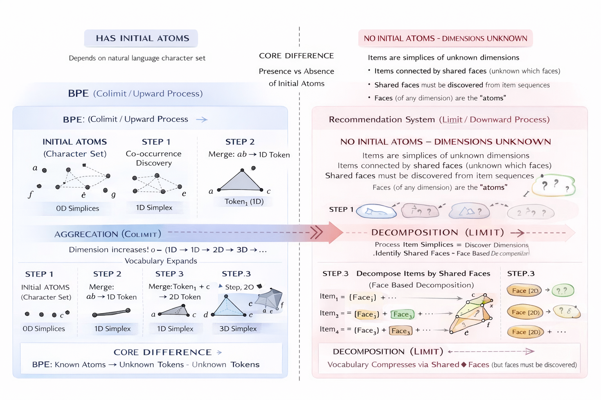

<blockquote class="cover-page">
  
词表诱导的本质探究

  <blockquote class="cover-subtitle">
  复形范畴中的极限与余极限及其在BPE中的应用与逆向分裂的探索
  </blockquote>
  

    
Igza Vit

    
2026.1.22

  

</blockquote>

<blockquote class="preface">

# 序言

　本笔记旨在建立复形范畴（simplicial complex category）与词表构建算法之间的理论桥梁。我们以范畴论为语言，将Byte Pair Encoding (BPE) 理解为复形范畴上的余极限操作，并探索是否存在一个对偶的极限过程——我们称之为"逆向分裂"（inverse splitting）——能够作为BPE的数学对偶。这是一个开放性问题：我们试图通过范畴论的理论框架，寻找或设计这样一个算法。

　　笔记分为三个主要部分：首先，我们建立基础概念框架，包括单纯形、单纯复形、共轭复形等核心定义，并引入加权复形与有向单纯复形以适应实际应用场景；其次，我们系统阐述复形范畴中的极限与余极限理论，包括积、拉回、余积、推出等核心构造，并探讨函子与伴随对的理论基础；最后，我们将理论应用于BPE算法，并探索是否存在一个对偶的"逆向分裂"算法，展示如何通过范畴论的视角理解词表构建的本质过程，以及如何设计BPE的对偶算法。

　　特别地，我们引入了代数拓扑中的同调理论与信息论中的渐进均分性（AEP），为设计逆向分裂算法提供了严格的数学基础。通过共轭复形的概念，我们探索了BPE与潜在逆向分裂算法之间的对偶关系：前者在原复形中通过余极限聚合原子为Token，后者（如果存在）应在共轭复形中通过极限分解全局模式为极小原子簇。

　　本笔记的目标读者是熟悉范畴论基础、对拓扑学有一定了解、并希望将抽象数学理论应用于实际算法设计的读者。我们力求在保持理论严谨性的同时，通过丰富的例子和直观的解释，使抽象概念变得可操作。

</blockquote>

  <h1>Contents</h1>
  

<blockquote class="chapter">

# 基础概念：单纯形与单纯复形

　　本章节建立复形范畴的基础概念框架。我们从最简单的组合对象——单纯形——开始，逐步构建更复杂的结构。单纯形是组合拓扑学的基本单元，它为我们提供了描述高维空间组合结构的方法。

<blockquote class="section">

## 单纯形（Simplex）

　　单纯形是组合拓扑学中最基本的几何对象。从直观上看，单纯形是点、线段、三角形、四面体等几何对象在组合意义上的抽象。在复形范畴中，单纯形不仅是几何对象，更是组合结构的载体。

<blockquote class="definition">

**单纯形**

给定非空有限顶点集 $V$，一个**单纯形** $\sigma$ 是 $V$ 的一个有限子集，即 $\sigma \subseteq V$ 且 $|\sigma| < \infty$。

单纯形 $\sigma$ 的**维度**定义为其顶点数减1：
$$
\dim \sigma = |\sigma| - 1
$$

- 0维单纯形：单点集 $\{v\}$，称为**顶点**；
- 1维单纯形：两点集 $\{v_1, v_2\}$，称为**边**；
- 2维单纯形：三点集 $\{v_1, v_2, v_3\}$，称为**三角形**；
- 3维单纯形：四点集 $\{v_1, v_2, v_3, v_4\}$，称为**四面体**。

对单纯形 $\sigma$，若 $\tau \subseteq \sigma$，则称 $\tau$ 是 $\sigma$ 的**面**（face）。
</blockquote>

<blockquote class="example">

**单纯形的例子**

设顶点集 $V = \{a, b, c\}$，则：
- $\{a\}$ 是0维单纯形（顶点）；
- $\{a, b\}$ 是1维单纯形（边）；
- $\{a, b, c\}$ 是2维单纯形（三角形）；
- $\{a\}$ 和 $\{a, b\}$ 都是 $\{a, b, c\}$ 的面。
</blockquote>

</blockquote>

　　单纯形为我们提供了基本的组合单元，但单独一个单纯形还不足以描述复杂的结构。我们需要将多个单纯形按照一定的规则组合起来，形成单纯复形。单纯复形通过"闭包公理"保证了结构的完整性：如果一个单纯形属于复形，那么它的所有面也必须属于这个复形。

<blockquote class="section">

## 单纯复形（Simplicial Complex）

　　单纯复形是单纯形的集合，它满足一定的组合约束。这些约束保证了复形在拓扑意义上是"良好"的：每个单纯形的面都在复形中，从而避免了"悬挂"的边或"不完整"的三角形。

<blockquote class="definition">

**单纯复形**

给定非空顶点集 $V$，一个**单纯复形**（或简称**复形**）$K$ 是 $V$ 的有限子集族（即单纯形的集合），满足以下三条公理：

1. **单点集公理**：若 $v \in V$，则 $\{v\} \in K$（所有顶点自身都是0维单纯形）；
2. **闭包公理**：若 $\sigma \in K$ 且 $\tau \subseteq \sigma$，则 $\tau \in K$（单纯形的任意面仍是该复形的单纯形）；
3. **局部有限性**：对任意 $v \in V$，仅含 $v$ 为顶点的单纯形个数有限。

复形 $K$ 的**维度**定义为所含单纯形的最大维度：
$$
\dim K = \max\{\dim \sigma \mid \sigma \in K\}
$$

若 $\dim K = d$，则称 $K$ 为**$d$维复形**。
</blockquote>

<blockquote class="remark">

**术语说明**

在本笔记中，**"复形"**一词特指**"单纯复形"**，即满足上述三条公理的单纯形集合。复形 $K$ 由两部分组成：
- **顶点集** $V_K$：复形中所有0维单纯形的顶点集合；
- **单纯形族** $K$：复形中所有单纯形的集合（包含顶点、边、三角形等）。
</blockquote>

<blockquote class="example">

**单纯复形的例子**

设顶点集 $V = \{a, b, c\}$，则：
- $K_1 = \{\{a\}, \{b\}, \{c\}\}$ 是0维复形（仅含顶点）；
- $K_2 = \{\{a\}, \{b\}, \{c\}, \{a, b\}, \{a, c\}\}$ 是1维复形（含顶点和边）；
- $K_3 = \{\{a\}, \{b\}, \{c\}, \{a, b\}, \{a, c\}, \{b, c\}, \{a, b, c\}\}$ 是2维复形（完整的三角形）。

注意：$K_2$ 不包含 $\{b, c\}$，因此不能形成完整的三角形。

**可视化**：单纯复形可以形象地理解为**超图**（hypergraph），其中：
- 顶点是0维单纯形（超图的节点）
- 边、三角形、四面体等高维单纯形是超图的超边（hyperedge）
- 复形的闭包公理保证了超边的"面"也是超边

</blockquote>

</blockquote>

　　单纯复形为我们提供了描述组合结构的数学语言。然而，在实际应用中，我们往往需要处理更复杂的结构：不仅要考虑单纯形之间的包含关系，还要考虑它们之间的"对偶"关系。共轭复形正是这样一种结构，它通过"顶点-单纯形反转"的方式，为我们提供了从另一个角度观察复形的工具。

<blockquote class="section">

## 共轭复形（Conjugate Complex）
<blockquote class="definition">

共轭复形的定义
设 $K$ 为 $n$ 维单纯复形，其共轭复形 $K^*$ 是满足“顶点-单纯形反转”的对偶复形，构造如下：
1. 顶点集：$V_{K^*} = \{ \sigma \mid \sigma \in K \}$（原复形的每个单纯形作为共轭复形的顶点）；
2. 单纯形族：对任意 $\tau \subseteq V_{K^*}$，$\tau \in K^*$ 当且仅当 $\{ \sigma \mid \sigma \in \tau \}$ 是原复形 $K$ 中的一个“闭覆盖”（即 $\bigcup_{\sigma \in \tau} \sigma$ 是 $K$ 的子复形，且 $\tau$ 满足极小性：不可被更小的子集覆盖替代）；
3. 维度范围：理论上，$K^*$ 可以包含任意维度的单纯形，其维度取决于原复形 $K$ 的结构。在极端情况下，如果原复形中每个句子都对应一个极高维的单纯形，那么共轭复形也会相应包含极高维结构。

共轭复形的核心性质：
- 对偶性：$(K^*)^* \cong K$（共轭复形的共轭复形同构于原复形）；
- 维度反转：若 $K$ 的维度为 $d$，则 $K^*$ 的维度为 $\max\{ k \mid \exists \tau \subseteq K_d, \tau \text{ 是闭覆盖} \}$（通常与原复形维度一致，理论上可以任意高）。

</blockquote>
</blockquote>

　　共轭复形为我们提供了观察复形的"对偶视角"，但要真正建立复形之间的映射关系，我们需要引入单纯映射的概念。单纯映射是复形范畴中的态射，它保持了复形的组合结构，使得我们可以在不同的复形之间建立有意义的对应关系。

<blockquote class="section">

## 单纯映射（Simplicial Map）

<blockquote class="definition">

**单纯映射**

　　单纯映射是复形之间的结构保持映射。它不仅将顶点映射到顶点，更重要的是，它将单纯形映射到单纯形（或更低维的单纯形），从而保持了复形的组合结构。这种结构保持性使得我们可以通过映射来比较不同的复形。

设 $K, L$ 为两个单纯复形，顶点集分别为 $V_K, V_L$。函数 $f: V_K \to V_L$ 称为从 $K$ 到 $L$ 的**单纯映射**（simplicial map），若满足：

对任意单纯形 $\sigma = \{v_1, v_2, ..., v_n\} \in K$，其像集 $f(\sigma) = \{f(v_1), f(v_2), ..., f(v_n)\}$ 也是 $L$ 中的单纯形，即 $f(\sigma) \in L$。

**延拓**：单纯映射 $f: V_K \to V_L$ 可自然延拓到全体单纯形上：对任意 $\sigma \in K$，定义 $f(\sigma) = \{f(v) \mid v \in \sigma\}$。延拓后的映射仍记为 $f: K \to L$。

**直观理解**：单纯映射是"保持单纯形结构"的顶点映射——将复形 $K$ 的顶点映射到复形 $L$ 的顶点，且保证 $K$ 中的每个单纯形都被映射到 $L$ 中的某个单纯形（可能是低维的）。
</blockquote>

<blockquote class="property">

**单纯映射的性质**

1. **维度单调性**：对任意 $\sigma \in K$，$\dim f(\sigma) \leq \dim \sigma$（映射可能降低维度，但不会增加）；
2. **复合封闭性**：若 $f: K \to L$、$g: L \to M$ 均为单纯映射，则复合映射 $g \circ f: K \to M$ 也是单纯映射；
3. **恒等映射**：对任意复形 $K$，存在恒等单纯映射 $\text{id}_K: K \to K$，满足 $\text{id}_K(v) = v$ 对所有 $v \in V_K$ 成立。
</blockquote>

<blockquote class="example">

**单纯映射的例子**

设 $K = \{\{a\}, \{b\}, \{a,b\}\}$，$L = \{\{x\}, \{y\}, \{x,y\}\}$，则：
- $f: a \mapsto x, b \mapsto y$ 是单纯映射（边映射到边）；
- $g: a \mapsto x, b \mapsto x$ 也是单纯映射（边映射到顶点，维度降低）；
- $h: a \mapsto x, b \mapsto y, c \mapsto z$（若 $c \in V_K$ 但 $\{a,c\} \notin K$）不是单纯映射（若 $\{a,c\} \in K$，则 $h(\{a,c\}) = \{x,z\}$ 必须在 $L$ 中）。
</blockquote>

</blockquote>

　　有了单纯映射作为态射，我们就可以将所有的单纯复形组织成一个范畴。这个范畴——复形范畴——不仅为我们提供了研究复形的统一框架，更重要的是，它是一个完备且余完备的范畴，这意味着极限与余极限的存在性得到了保证。

<blockquote class="section">

## 复形范畴

<blockquote class="definition">

　　有了单纯映射作为态射，我们就可以将所有的单纯复形组织成一个范畴。这个范畴不仅包含了所有的复形对象，更重要的是，它通过态射（单纯映射）建立了复形之间的关系，使得我们可以用范畴论的语言来研究复形。

复形范畴 $\mathbf{Comp}$ 由以下三部分构成：

1. 对象类 $\text{Ob}(\mathbf{Comp})$：全体单纯复形；
2. 态射集 $\text{Hom}(K, L)$：对任意 $K, L \in \text{Ob}(\mathbf{Comp})$，$\text{Hom}(K, L)$ 为所有从 $K$ 到 $L$ 的单纯映射；
3. 复合运算 $\circ$：对任意 $f \in \text{Hom}(K, L)$、$g \in \text{Hom}(L, M)$，复合运算 $g \circ f \in \text{Hom}(K, M)$ 为单纯映射的复合。

该范畴满足范畴公理：结合律 $(h \circ g) \circ f = h \circ (g \circ f)$，且对任意对象存在恒等态射。
</blockquote>

<blockquote class="property">

复形范畴的核心性质
1. 完备性：$\mathbf{Comp}$ 是完备范畴，即对任意小图表 $\mathcal{D}: \mathcal{I} \to \mathbf{Comp}$，均存在极限 $\lim_{\leftarrow} \mathcal{D}$；
2. 余完备性：$\mathbf{Comp}$ 是余完备范畴，即对任意小图表 $\mathcal{D}: \mathcal{I} \to \mathbf{Comp}$，均存在余极限 $\lim_{\rightarrow} \mathcal{D}$；
3. 全子范畴继承性：若 $\mathbf{C}$ 是 $\mathbf{Comp}$ 的全子范畴（对象为 $\mathbf{Comp}$ 的子集，态射与 $\mathbf{Comp}$ 一致），则 $\mathbf{C}$ 继承 $\mathbf{Comp}$ 的完备性/余完备性（若图表 $\mathcal{D}$ 的对象均在 $\mathbf{C}$ 中）。
</blockquote>

</blockquote>

　　复形范畴为我们提供了研究复形结构的抽象框架，但在实际应用中，我们往往需要处理带有额外信息的复形。例如，在分析交互序列时，我们需要考虑物品之间的时序关系（有向性）和共现频率（权重）。加权复形与有向单纯复形正是为了满足这些实际需求而引入的概念。

<blockquote class="section">

## 加权复形与有向单纯复形

<blockquote class="definition">

　　在实际应用中，我们往往需要为复形中的单纯形赋予额外的信息。权重可以表示频率、重要性或概率等量，而有向性则可以表示时序关系或因果关系。这些额外的结构使得复形能够更好地描述实际数据。

**加权复形（Weighted Complex）**

设 $K$ 为单纯复形，**加权复形** $(K, w)$ 是在 $K$ 上赋予权重函数 $w: K \to \mathbb{R}_{\geq 0}$ 的复形，其中 $w(\sigma)$ 表示单纯形 $\sigma$ 的权重。

**有向单纯复形（Oriented Simplicial Complex）**

设 $K$ 为单纯复形，**有向单纯复形** $(K, \text{or})$ 是在 $K$ 上赋予定向函数 $\text{or}: K \to \{\pm 1\}$ 的复形，其中对 $d$ 维单纯形 $\sigma = \{v_0, v_1, ..., v_d\}$，$\text{or}(\sigma)$ 表示其顶点的排列顺序（等价于定向）。

**有向加权复形**：同时具有权重和定向的复形 $(K, w, \text{or})$。
</blockquote>

<blockquote class="example">

**加权复形的例子**

在交互序列分析中，设 $K$ 为物品交互复形：
- 顶点 $\{i\}$ 的权重 $w(\{i\})$ 可表示物品 $i$ 的出现频率；
- 边 $\{i, j\}$ 的权重 $w(\{i, j\})$ 可表示物品对 $(i, j)$ 的共现频率；
- 三角形 $\{i, j, k\}$ 的权重 $w(\{i, j, k\})$ 可表示三元组 $(i, j, k)$ 的共现频率。

**有向单纯复形的例子**

在序列数据中，有向边 $\overrightarrow{(i, j)}$ 表示"物品 $i$ 在物品 $j$ 之前出现"，有向三角形 $\overrightarrow{(i, j, k)}$ 表示"物品 $i \to j \to k$ 的时序关系"。

</blockquote>

<blockquote class="remark">

**加权与有向的动机**

在设计逆向分裂算法时，我们需要考虑如何从交互序列构造全局交互复形：
- **加权**：通过频率统计，识别"典型"的交互模式（高频单纯形）；
- **有向**：通过时序关系，捕捉物品间的因果关系（$i \to j$ 表示 $i$ 先于 $j$ 出现）。

这种"加权+有向"的结构为极限过程提供了自然的约束条件。
</blockquote>

</blockquote>

</blockquote>

<blockquote class="chapter">

# 代数拓扑：同调与信息论基础

<blockquote class="section">

## 链复形与边界算子

<blockquote class="definition">

链复形是代数拓扑的核心工具。它将几何问题转化为代数问题：通过将单纯形视为"基向量"，我们可以用线性代数的方法来研究复形的拓扑性质。边界算子则告诉我们如何从高维单纯形"提取"低维边界。

**链群（Chain Group）**

设 $K$ 为单纯复形，$C_d(K)$ 表示 $K$ 的 $d$ 维**链群**，即所有 $d$ 维单纯形的形式线性组合：
$$
C_d(K) = \left\{ \sum_{\sigma \in K_d} c_\sigma \sigma \mid c_\sigma \in \mathbb{Z} \right\}
$$
其中 $K_d = \{\sigma \in K \mid \dim \sigma = d\}$ 为 $d$ 维单纯形集合。

**边界算子（Boundary Operator）**

对 $d$ 维单纯形 $\sigma = \{v_0, v_1, ..., v_d\}$，其**边界算子** $\partial_d: C_d(K) \to C_{d-1}(K)$ 定义为：
$$
\partial_d(\sigma) = \sum_{i=0}^{d} (-1)^i \{v_0, ..., \hat{v_i}, ..., v_d\}
$$
其中 $\hat{v_i}$ 表示删除顶点 $v_i$，$(-1)^i$ 为定向符号。

**链复形（Chain Complex）**

链复形是链群与边界算子的序列：
$$
\cdots \xrightarrow{\partial_{d+1}} C_d(K) \xrightarrow{\partial_d} C_{d-1}(K) \xrightarrow{\partial_{d-1}} \cdots
$$
满足 $\partial_d \circ \partial_{d+1} = 0$（边界无边界）。
</blockquote>

<blockquote class="property">

**边界算子的性质**

1. **零性**：$\partial_d \circ \partial_{d+1} = 0$（边界无边界）；
2. **线性性**：$\partial_d(\alpha \sigma + \beta \tau) = \alpha \partial_d(\sigma) + \beta \partial_d(\tau)$；
3. **维度降低**：$\partial_d: C_d(K) \to C_{d-1}(K)$ 将 $d$ 维链映射到 $(d-1)$ 维链。
</blockquote>

</blockquote>

　　边界算子为我们提供了研究复形局部结构的方法，但更重要的是，我们可以通过边界算子定义同调群，从而捕捉复形的全局拓扑特征。同调群量化了复形中的"洞"和"空腔"，而Betti数则给出了这些拓扑特征的数量。

<blockquote class="section">

## 同调群与Betti数

<blockquote class="definition">

边界算子为我们提供了研究复形局部结构的方法，但更重要的是，我们可以通过边界算子定义同调群。同调群捕捉了复形中的"洞"和"空腔"——这些是拓扑不变量，不依赖于复形的具体表示方式。

**同调群（Homology Group）**

设 $K$ 为单纯复形，$d$ 维**同调群**定义为：
$$
H_d(K) = \frac{\ker \partial_d}{\text{im} \ \partial_{d+1}} = \frac{Z_d(K)}{B_d(K)}
$$
其中：
- $Z_d(K) = \ker \partial_d$ 为 $d$ 维**闭链群**（cycles，边界为零的链）；
- $B_d(K) = \text{im} \ \partial_{d+1}$ 为 $d$ 维**边界链群**（boundaries，某 $(d+1)$ 维链的边界）。

**Betti数（Betti Number）**

$d$ 维**Betti数** $\beta_d(K)$ 定义为 $d$ 维同调群的秩（自由部分的维数）：
$$
\beta_d(K) = \text{rank} \ H_d(K)
$$

**直观理解**：
- $\beta_0(K)$：连通分支数；
- $\beta_1(K)$："洞"的个数（1维同调，如圆环）；
- $\beta_2(K)$："空腔"的个数（2维同调，如球面）。
</blockquote>

<blockquote class="example">

**同调群的例子**

设 $K$ 为三角形复形 $\{\{a\}, \{b\}, \{c\}, \{a,b\}, \{b,c\}, \{a,c\}, \{a,b,c\}\}$：
- $H_0(K) \cong \mathbb{Z}$（$\beta_0 = 1$，一个连通分支）；
- $H_1(K) = 0$（$\beta_1 = 0$，无洞）；
- $H_2(K) = 0$（$\beta_2 = 0$，无空腔）。

若 $K$ 为圆环（仅边界，无内部），则 $\beta_1 = 1$（一个洞）。
</blockquote>

<blockquote class="remark">

**同调在逆向分裂设计中的意义**

在设计逆向分裂算法时，同调群可以帮助我们识别"不可约的"交互模式：
- **闭链** $Z_d(K)$：表示 $d$ 维的"闭合"交互模式（如循环推荐路径）；
- **边界链** $B_d(K)$：表示 $d$ 维的"可分解"交互模式（可由更高维模式导出）；
- **同调类** $H_d(K)$：表示 $d$ 维的"本质"交互模式（不可由更高维模式导出，也不可分解为更低维模式）。

Betti数 $\beta_d$ 量化了 $d$ 维"本质模式"的数量，为极限过程提供了自然的"极小性"判据。
</blockquote>

</blockquote>

　　同调理论为我们提供了研究复形拓扑结构的工具，但在从实际数据构造复形时，我们还需要考虑数据的统计特性。信息论中的渐进均分性（AEP）告诉我们，当样本量足够大时，数据中的"典型"模式会收敛到理论分布，这为我们在极限过程中识别"典型"交互模式提供了理论依据。

<blockquote class="section">

## 信息论基础：典范集与渐进均分性

<blockquote class="definition">

信息论为我们提供了从统计角度理解数据的工具。渐进均分性（AEP）告诉我们，当样本量足够大时，数据中的"典型"模式会占据主导地位，而"非典型"模式会逐渐消失。这为我们在极限过程中识别"典型"交互模式提供了理论依据。

**典范集（Typical Set）**

设 $X_1, X_2, ..., X_n$ 为独立同分布的随机变量序列，其联合概率为 $p(x_1, ..., x_n) = \prod_{i=1}^n p(x_i)$。对 $\epsilon > 0$，**$\epsilon$-典范集** $A_\epsilon^{(n)}$ 定义为：
$$
A_\epsilon^{(n)} = \left\{ (x_1, ..., x_n) \mid \left| -\frac{1}{n} \log p(x_1, ..., x_n) - H(X) \right| < \epsilon \right\}
$$
其中 $H(X) = -\sum_x p(x) \log p(x)$ 为熵。

**渐进均分性（Asymptotic Equipartition Property, AEP）**

渐进均分性定理：对任意 $\epsilon > 0$，当 $n \to \infty$ 时：
1. $P(A_\epsilon^{(n)}) > 1 - \epsilon$（典范集的概率趋于1）；
2. $|A_\epsilon^{(n)}| \leq 2^{n(H(X) + \epsilon)}$（典范集的大小上界）；
3. $|A_\epsilon^{(n)}| \geq (1 - \epsilon) 2^{n(H(X) - \epsilon)}$（典范集的大小下界）。

**直观理解**：当样本量 $n$ 足够大时，几乎所有序列的"典型"概率约为 $2^{-nH(X)}$，且典型序列的数量约为 $2^{nH(X)}$。
</blockquote>

<blockquote class="property">

**典范集的性质**

1. **高概率性**：当 $n$ 足够大时，随机序列几乎必然落在典范集中；
2. **等概率性**：典范集中的序列具有近似相等的概率（约 $2^{-nH(X)}$）；
3. **指数增长**：典范集的大小以 $2^{nH(X)}$ 的速率增长（熵决定增长率）。
</blockquote>

<blockquote class="remark">

**AEP在逆向分裂设计中的意义**

在设计从交互序列构造全局交互复形的过程时，AEP提供了理论指导：
- **典型性判据**：随着样本量 $n \to \infty$，交互序列中的"典型"模式（高频单纯形）会收敛到典范集，其频率收敛到理论概率；
- **权重收敛**：有向边 $\overrightarrow{(i, j)}$ 的权重 $w(\{i, j\})$ 在 $n \to \infty$ 时收敛到 $p(i, j)$（若收敛于0，则对应这两个物品没有稳定的先后关系）；
- **极限构造**：全局交互复形的构造本质是识别"典型"交互模式（典范集中的元素），通过极限过程提取不可约的原子簇。

这种"典型性+极限"的框架为设计逆向分裂算法提供了严格的信息论基础。**注意**：从序列构造全局复形本身是一个开放性问题，AEP提供了渐近理论，但实际构造仍需结合工程约束。
</blockquote>

</blockquote>

</blockquote>

　　在建立了基础概念框架之后，我们现在转向复形范畴的核心构造：极限与余极限。这些构造不仅是范畴论的核心概念，更是我们理解BPE算法和探索其潜在对偶算法的关键。极限与余极限分别对应"分解"与"聚合"两种操作，它们通过泛性质保证了构造的唯一性和最优性。我们希望通过极限理论，找到或设计一个与BPE对偶的算法。

<blockquote class="chapter">

#  复形范畴的极限与余极限

<blockquote class="section">

## 极限的定义与核心构造

极限是范畴论中最重要的构造之一。它通过"泛性质"来定义，这意味着极限不是通过具体的构造方式定义的，而是通过它与其他对象的关系来定义的。这种定义方式使得极限具有了"最优性"：它是满足某种条件的所有对象中"最好"的那个。

<blockquote class="definition">

**极限（Limit）**

设 $\mathcal{I}$ 为小指标范畴，$\mathcal{D}: \mathcal{I} \to \mathbf{Comp}$ 为图表（将 $\mathcal{I}$ 的对象映射到复形，态射映射到单纯映射）。

图表 $\mathcal{D}$ 的**极限**是一个复形 $L \in \text{Ob}(\mathbf{Comp})$ 及一族**投影态射** $\{\pi_i: L \to \mathcal{D}(i)\}_{i \in \mathcal{I}}$，满足以下**泛性质**：

对任意复形 $X \in \text{Ob}(\mathbf{Comp})$ 及态射族 $\{f_i: X \to \mathcal{D}(i)\}_{i \in \mathcal{I}}$，存在**唯一**态射 $f: X \to L$，使得对所有 $i \in \mathcal{I}$，$\pi_i \circ f = f_i$。

极限记为 $\lim_{\leftarrow} \mathcal{D}$ 或 $\lim \mathcal{D}$。

**直观理解**：极限是"最通用的对象"，能够通过投影"分解"到图表中的每个对象，且这种分解是"最经济的"（任何其他对象到图表对象的映射，都能唯一地通过极限"中介"）。
</blockquote>

<blockquote class="remark">

**极限的直观类比**

极限类似于集合论中的**交集**或**笛卡尔积**：
- 积（Product）：多个复形的"最大公共子结构"；
- 拉回（Pullback）：在约束条件下的"最大公共子结构"。

极限的核心是"分解"（decomposition）——从整体分解到部分。
</blockquote>

<blockquote class="remark">

**极限的动机：探索BPE的对偶过程**

在分析BPE算法时，我们发现它本质上是复形范畴上的余极限过程（从原子聚合为Token）。我们探索是否存在一个对偶的极限过程——逆向分裂——使得：
- 输入是全局的交互模式（高维单纯形）；
- 输出是极小的原子簇（低维单纯形）；
- 通过拉回构造，在约束条件下分解整体为基元。

这种"分解"的极限过程与BPE的"聚合"余极限过程在理论上形成自然的对偶关系。**注意**：这样的算法是否存在、如何实现，仍是一个开放性问题。
</blockquote>

<blockquote class="example">

积是最简单的极限构造。它通过"同时包含两个复形的信息"来构造一个新的复形。在复形范畴中，积的构造是通过顶点的笛卡尔积来实现的，这保证了新复形包含了原复形的所有信息。

**核心构造1：积（Product）**

对任意两个复形 $K, L \in \text{Ob}(\mathbf{Comp})$，其**积** $K \times L$ 定义为：

1. **顶点集**：$V_{K \times L} = V_K \times V_L$（顶点的笛卡尔积，即所有有序对 $(v, w)$，其中 $v \in V_K, w \in V_L$）；
2. **单纯形族**：$\sigma \in K \times L$ 当且仅当 $\sigma$ 是 $V_{K \times L}$ 的有限子集，且其在 $K$、$L$ 上的投影（分别取第一、第二分量）分别为 $K$、$L$ 中的单纯形。

**投影态射**：$\pi_1: K \times L \to K$ 和 $\pi_2: K \times L \to L$ 分别定义为取顶点的第一、第二分量。

**泛性质交换图**：
$$
\begin{CD}
X @>{f_1}>> K \\
@V{f_2}VV @AA{\pi_1}A \\
L @>>{\pi_2}> K \times L \\
@. @AA{\exists! f}A \\
@. X
\end{CD}
$$

**直观理解**：积是"同时包含 $K$ 和 $L$ 的信息"的最大对象，通过投影可以"提取"任一因子的信息。
</blockquote>

<blockquote class="example">

拉回是积的推广。它不仅在两个复形之间构造积，还要求这个积与第三个复形通过态射"对齐"。这种对齐关系使得拉回能够捕捉"公共子结构"，这正是我们在设计逆向分裂算法时希望捕捉的"极小原子簇"的数学本质。

**核心构造2：拉回（Pullback）**

给定态射 $f: K \to M$、$g: L \to M$，**拉回** $K \times_M L$ 是满足 $f \circ \pi_1 = g \circ \pi_2$ 的极限对象。

**核心交换方块**：
$$
\begin{CD}
K \times_M L @>{\pi_1}>> K \\
@V{\pi_2}VV @VV{f}V \\
L @>>{g}> M
\end{CD}
$$

**拉回的具体构造**：
1. **顶点集**：$V_{K \times_M L} = \{(v, w) \in V_K \times V_L \mid f(v) = g(w)\}$（仅保留在 $M$ 中"匹配"的顶点对）；
2. **单纯形族**：$\sigma \in K \times_M L$ 当且仅当 $\pi_1(\sigma) \in K$ 且 $\pi_2(\sigma) \in L$（投影后仍为单纯形）。

**直观理解**：拉回是"在约束 $M$ 下，$K$ 和 $L$ 的最大公共子结构"——只保留那些在 $M$ 中"对齐"的部分。

**拉回的交换图**：
$$
\begin{CD}
K \times_M L @>{\pi_1}>> K \\
@V{\pi_2}VV @VV{f}V \\
L @>>{g}> M
\end{CD}
$$
</blockquote>

</blockquote>

　　极限为我们提供了"分解"的数学工具，而余极限则提供了"聚合"的工具。在复形范畴中，余极限通过"粘贴"的方式将多个复形组合成一个更大的复形，这正是BPE算法中"合并原子为Token"的数学本质。

<blockquote class="section">

## 余极限的定义与核心构造

余极限是极限的对偶概念。如果说极限对应"分解"（从整体到部分），那么余极限就对应"聚合"（从部分到整体）。在复形范畴中，余极限通过"粘贴"的方式将多个复形组合成一个更大的复形，这正是BPE算法中"合并原子为Token"的数学本质。

<blockquote class="definition">

**余极限（Colimit）**

设 $\mathcal{I}$ 为小指标范畴，$\mathcal{D}: \mathcal{I} \to \mathbf{Comp}$ 为图表。

图表 $\mathcal{D}$ 的**余极限**是一个复形 $C \in \text{Ob}(\mathbf{Comp})$ 及一族**嵌入态射** $\{\iota_i: \mathcal{D}(i) \to C\}_{i \in \mathcal{I}}$，满足以下**泛性质**：

对任意复形 $Y \in \text{Ob}(\mathbf{Comp})$ 及态射族 $\{g_i: \mathcal{D}(i) \to Y\}_{i \in \mathcal{I}}$，存在**唯一**态射 $g: C \to Y$，使得对所有 $i \in \mathcal{I}$，$g \circ \iota_i = g_i$。

余极限记为 $\lim_{\rightarrow} \mathcal{D}$ 或 $\text{colim} \mathcal{D}$。

**直观理解**：余极限是"最通用的对象"，能够通过嵌入"包含"图表中的每个对象，且这种包含是"最经济的"（任何从图表对象到其他对象的映射，都能唯一地通过余极限"中介"）。
</blockquote>

<blockquote class="remark">

**余极限的直观类比**

余极限类似于集合论中的**并集**或**商集**：
- 余积（Coproduct）：多个复形的"最小公共超结构"（无交并）；
- 推出（Pushout）：在约束条件下的"最小公共超结构"（模等价关系）。

余极限的核心是"聚合"（aggregation）——从部分聚合到整体。
</blockquote>

<blockquote class="remark">

**余极限的动机：BPE的范畴论诠释**

BPE（Byte Pair Encoding）算法的核心操作是迭代地将频繁出现的相邻Token对合并为新Token。从复形范畴的视角看，这个过程可以精确地描述为余极限：
- 初始状态：原子集合（0维单纯形）对应预设的字符表；
- 迭代过程：通过推出构造，在"连续子串"约束下，将低维单纯形（原子/低维Token）粘贴为高维单纯形（高维Token）；
- 最终状态：完整的BPE词表对应原复形 $K$ 的全体单纯形族，其维度理论上可以任意高。在极端情况下，每个句子可以对应一个极高维的单纯形（包含该句子的所有Token）。实际应用中，我们需要在"记忆效率"与"泛化能力"之间找到平衡点，通过约束条件（如连续子串长度限制）来控制维度增长。

这种"聚合"的余极限过程为BPE提供了严格的数学框架，同时也启发我们寻找对偶的极限过程作为逆向算法。
</blockquote>

<blockquote class="example">

余积是最简单的余极限构造。它通过"无交并"的方式将两个复形组合在一起，不进行任何"粘贴"操作。这种构造保证了原复形的结构完全保留，同时新复形包含了两个原复形的所有信息。

**核心构造1：余积（Coproduct）**

对任意两个复形 $K, L \in \text{Ob}(\mathbf{Comp})$，其**余积** $K \sqcup L$ 定义为：

1. **顶点集**：$V_{K \sqcup L} = V_K \sqcup V_L$（顶点的无交并，即 $K$ 和 $L$ 的顶点"并排放置"，不重叠）；
2. **单纯形族**：$\sigma \in K \sqcup L$ 当且仅当 $\sigma \subseteq V_K$ 且 $\sigma \in K$，或 $\sigma \subseteq V_L$ 且 $\sigma \in L$（单纯形来自 $K$ 或 $L$，但不能跨两者）。

**嵌入态射**：$\iota_1: K \to K \sqcup L$ 和 $\iota_2: L \to K \sqcup L$ 分别为将 $K$、$L$ 的顶点嵌入到无交并中。

**泛性质交换图**：
$$
\begin{CD}
K @>{\iota_1}>> K \sqcup L @<{\iota_2}<< L \\
@V{g_1}VV @AA{\exists! g}A @VV{g_2}V \\
Y @= Y @= Y
\end{CD}
$$

**直观理解**：余积是"同时包含 $K$ 和 $L$ 的信息"的最小对象，通过嵌入可以"注入"任一因子的信息。
</blockquote>

<blockquote class="example">

推出是余积的推广。它不仅将两个复形组合在一起，还要求它们沿着一个公共子复形"粘贴"。这种粘贴关系使得推出能够捕捉"共享结构"，这正是BPE算法中"连续子串约束"的数学本质。

**核心构造2：推出（Pushout）**

给定态射 $f: M \to K$、$g: M \to L$，**推出** $K \sqcup_M L$ 是满足 $\iota_1 \circ f = \iota_2 \circ g$ 的余极限对象。

**核心交换方块**：
$$
\begin{CD}
M @>{f}>> K \\
@V{g}VV @VV{\iota_1}V \\
L @>>{\iota_2}> K \sqcup_M L
\end{CD}
$$

**推出的具体构造**：
1. **顶点集**：$V_{K \sqcup_M L} = (V_K \sqcup V_L)/\sim$（无交并模等价关系：对任意 $v \in V_M$，$f(v) \sim g(v)$，即 $M$ 中顶点的像在 $K$ 和 $L$ 中被"粘合"）；
2. **单纯形族**：$\sigma \in K \sqcup_M L$ 当且仅当 $\sigma$ 的代表元集是 $K$ 或 $L$ 中的单纯形（在等价关系下保持单纯形结构）。

**直观理解**：推出是"在约束 $M$ 下，$K$ 和 $L$ 的最小公共超结构"——将 $K$ 和 $L$ 沿着 $M$ 的像"粘贴"在一起。

**推出的交换图**（使用LaTeX CD环境）：
$$
\begin{CD}
M @>{f}>> K \\
@V{g}VV @VV{\iota_1}V \\
L @>>{\iota_2}> K \sqcup_M L
\end{CD}
$$
</blockquote>

</blockquote>
<blockquote class="subsection">

### 函数芽：余极限的一个直观例子

函数芽是数学分析中的一个经典概念，它为我们提供了理解余极限的直观例子。函数芽通过"局部粘贴为整体"的方式构造，这与BPE算法中"原子粘贴为Token"的逻辑完全一致。通过这个例子，我们可以看到余极限并非抽象的范畴构造，而是有着深刻的几何和代数内涵。
  <blockquote class="definition">

设 $X$ 为拓扑空间，$x_0 \in X$，考虑所有在 $x_0$ 的某个邻域内有定义的连续函数构成的集合 $$\mathcal{F} = \{ f: U \to \mathbb{R} \mid U \text{ 是 } x_0 \text{ 的邻域}, f \text{ 连续} \}$$定义等价关系 $\sim$：$f \sim g$ 当且仅当存在 $x_0$ 的邻域 $V \subseteq \text{dom}(f) \cap \text{dom}(g)$，使得 $f|_V = g|_V$（即 $f$ 与 $g$ 在 $x_0$ 附近局部相等）。
函数芽（Germ of Functions） $[f]_{x_0}$ 是 $f$ 关于 $\sim$ 的等价类，
核心是“函数在某点附近的局部行为等价类”。
</blockquote>
<blockquote class="example">

**函数芽的余极限构造**
将函数芽的生成过程转化为复形范畴的余极限，直观体现“局部粘贴为整体”的核心逻辑：

构造图表 $\mathcal{D}$：
- 指标范畴 $\mathcal{I}$：对象为 $x_0$ 的所有邻域 $U$，态射为邻域的包含关系 $U \to V$（若 $V \subseteq U$）；
- 图表赋值：对每个邻域 $U$，定义复形 $K_U = F(\text{dom}(f|_U))$（自由复形，顶点为函数定义域的点，单纯形为局部交互关系）；
- 态射赋值：对包含关系 $U \to V$，定义单纯映射 $f_{UV}: K_U \to K_V$ 为自由函子延拓的包含映射（保留局部结构）。
1. 余极限对象：
   图表 $\mathcal{D}$ 的余极限 $\lim_{\rightarrow} K_U$ 即为“函数芽复形”——其顶点集为所有局部定义域的无交并模“局部相等”等价关系，单纯形族为局部单纯形的粘贴结果，对应函数芽 $[f]_{x_0}$ 的局部行为抽象。

**余极限泛性质的体现**：
任意“全局连续函数对应的复形” $L$，若存在局部态射族 $$\{ g_U: K_U \to L \}$$，则存在唯一态射 $$g: \lim_{\rightarrow} K_U \to L,$$即“局部行为唯一确定全局等价类”，与函数芽的定义完全契合。
</blockquote>

<blockquote class="remark">

函数芽与BPE的共性
1. 局部→整体：函数芽是“局部函数粘贴为全局等价类”，BPE是“局部原子粘贴为全局Token”，均为余极限的“粘贴”逻辑；
2. 等价关系核心：函数芽的“局部相等”等价关系，对应BPE的“连续子串约束”（推出构造中的等价关系 $f(v) \sim g(v)$）；
3. 直观性：函数芽是余极限最贴近直觉的实例，帮助理解BPE的余极限本质——并非抽象的范畴构造，而是“局部约束下的全局聚合”。
</blockquote>
  
</blockquote>
</blockquote>

　　极限与余极限为我们提供了构造复形的方法，但要在不同的范畴之间建立联系，我们需要引入函子的概念。函子不仅可以将复形映射到其他结构，更重要的是，通过伴随对的概念，我们可以理解BPE中"自由生成"与"结构遗忘"之间的对偶关系。

<blockquote class="chapter">

# 函子与伴随对
<blockquote class="section">

## 遗忘函子（Forgetful Functor）

函子是范畴之间的映射，它保持了范畴的结构。遗忘函子是一个特殊的函子，它"忘记"了复形的结构，只保留了顶点集。这种"遗忘"操作看似简单，但它为我们提供了理解"结构"与"载体"之间关系的重要工具。

<blockquote class="definition">

遗忘函子的定义
复形范畴到集合范畴的遗忘函子 $$U: \mathbf{Comp} \to \mathbf{Set}$$，核心是“忘掉附加结构，保留核心载体”：
1. 对象层面：对任意单纯复形 $K \in \text{Ob}(\mathbf{Comp})$，$U(K) = V_K$（仅保留复形的顶点集，舍弃单纯形族、维度、方向等结构信息）；
2. 态射层面：对任意单纯映射 $f: K \to L \in \text{Hom}(\mathbf{Comp})$，$U(f) = f|_{V_K}: V_K \to V_L$（仅保留顶点集上的基础映射，忘掉“保持单纯形结构”的约束）。

遗忘函子的核心性质：
- 忠实性（Faithful）：若 $U(f) = U(g)$，则 $f = g$（复形间的单纯映射由顶点映射唯一确定）；
- 不-full性：并非所有集合映射都能被提升为单纯映射（需满足“保持单纯形”约束）。
</blockquote>
</blockquote>

<blockquote class="section">

## 自由函子（Free Functor）

自由函子是遗忘函子的左伴随。如果说遗忘函子是"剥离结构"，那么自由函子就是"装配结构"。它从最简单的集合出发，为其"装配"最小的复形结构，使得这个复形包含了集合的所有信息，同时不包含任何多余的结构。

<blockquote class="definition">

自由函子的定义
集合范畴到复形范畴的自由函子 $F: \mathbf{Set} \to \mathbf{Comp}$，是遗忘函子的左伴随，核心是“从基础载体生成最小附加结构”：
1. 对象层面：对任意集合 $S \in \text{Ob}(\mathbf{Set})$，$F(S)$ 为“自由单纯复形”——其单纯形族是 $S$ 的所有有限子集（自动满足单纯复形的三点公理），即：
$$
F(S) = \{ \sigma \mid \sigma \subseteq S, \sigma \text{ 有限} \}
$$
2. 态射层面：对任意集合映射 $h: S \to T \in \text{Hom}(\mathbf{Set})$，$F(h): F(S) \to F(T)$ 为自然延拓的单纯映射，满足 $F(h)(\sigma) = \{ h(v) \mid v \in \sigma \}$（自动保持单纯形结构）。
</blockquote>

<blockquote class="property">

伴随函子对的核心关系
遗忘函子 $U$ 与自由函子 $F$ 构成伴随对 $(F \dashv U)$，即对任意集合 $S \in \mathbf{Set}$、复形 $K \in \mathbf{Comp}$，存在自然同构：
$$
\text{Hom}_{\mathbf{Comp}}(F(S), K) \cong \text{Hom}_{\mathbf{Set}}(S, U(K))
$$
直观含义：“从自由复形到任意复形的单纯映射”，等价于“从集合到复形顶点集的基础映射”——自由函子为集合“装配”最小复形结构，遗忘函子则“剥离”结构还原为集合。
</blockquote>

<blockquote class="example">

自由函子在BPE中的应用
BPE的“预设原子表”本质是自由函子的输出：
设 $S$ 为预设原子集合（如字符集 $\{a, b, c, ...\}$），则 $F(S)$ 为“原子复形”（0维复形，仅含单点单纯形）；
BPE的初始词表对应 $U(F(S)) = S$（遗忘函子提取顶点集），后续聚合过程则是在自由复形基础上通过余极限（推出）生成高维单纯形（高维Token）。
</blockquote>
</blockquote>
</blockquote>

<blockquote class="chapter">

# 应用：BPE的复形诠释与逆向分裂的
<blockquote class="figure">

</blockquote>

<blockquote class="section">

## BPE作为余极限过程

BPE（Byte Pair Encoding）是自然语言处理中广泛使用的词表构建算法。从范畴论的视角来看，BPE的本质是在原复形中通过余极限操作将原子聚合为Token。这种理解不仅揭示了BPE的数学本质，更为我们设计新的词表构建算法提供了理论指导。

<blockquote class="definition">

**BPE的原复形结构**

正向BPE的整个过程均在**原复形** $K$ 中进行，其结构对应关系如下：
1. **初始状态**：预设原子表对应 $K$ 的0维单纯形（顶点），即 $V_K = S$（原子集合），$K_0 = \{\{v\} \mid v \in V_K\}$（0维单纯形族）；
2. 聚合过程：通过余极限（推出）构造，将满足“连续子串约束”的低维单纯形（原子/低维Token）粘贴为高维单纯形（高维Token），即 $K_d$（$d \geq 1$）为不同维度的Token集合。理论上，维度可以任意高，不受限制；
3. 最终状态：完整BPE词表对应 $K$ 的全体单纯形族，其维度理论上可以任意高。在极端情况下，每个句子可以对应一个极高维的单纯形（包含该句子的所有Token）。实际应用中，我们通过约束条件（如连续子串长度限制）来控制维度，在"记忆效率"与"泛化能力"之间找到平衡点。词表规模随高维单纯形的生成而增大（基元→整体）；
4. 核心特征：$K$ 的顶点是“原子”，单纯形是“原子组合的Token”，结构为“原子→Token”（顶点→单纯形）。
</blockquote>
</blockquote>

　　BPE算法通过余极限将原子聚合为Token。我们探索是否存在一个对偶的算法——逆向分裂——能够通过极限将全局交互模式分解为极小原子簇。如果这样的算法存在，它在数学结构上应与BPE对偶：BPE在原复形中进行，而逆向分裂应在共轭复形中进行，它们通过"顶点-单纯形反转"形成自然的对偶关系。

<blockquote class="section">

## 逆向分裂作为极限过程：一个开放性问题

我们探索是否存在一个与BPE对偶的算法——逆向分裂。如果说BPE是通过余极限"聚合"原子为Token，那么逆向分裂（如果存在）应该通过极限"分解"全局交互模式为极小原子簇。这种对偶关系不仅应体现在算法结构上，更应体现在它们所操作的复形上：BPE在原复形中进行，而逆向分裂应在共轭复形中进行。**注意**：逆向分裂是否存在、如何实现，仍是一个开放性问题。

<blockquote class="example">

逆向分裂的理论设计：共轭复形结构
如果逆向分裂算法存在，其过程应在共轭复形 $K^*$ 中进行，其与共轭复形的理论对应关系应为：
1. 初始状态：输入的“物品编号+交互序列”对应 $K^*$ 的0维单纯形（顶点），即 $V_{K^*} = \{ \sigma \mid \sigma \in K \}$（原复形的Token作为共轭复形的顶点）；
2. 拆解过程：通过极限（拉回）构造，将满足“频率+极小性约束”的高维单纯形（全局交互模式）分解为低维单纯形（极小原子簇），即 $K^*_d$（$d \geq 1$）为不同维度的原子簇集合。理论上，输入的高维单纯形可以任意高，不受限制；
3. 最终状态：全局极小原子簇对应 $K^*$ 的全体单纯形族，其维度理论上可以任意高。在极端情况下，如果输入是极高维的全局交互模式，分解过程也会产生相应的高维结构。实际应用中，我们通过约束条件（如频率阈值、极小性要求）来控制维度，在"泛化能力"与"记忆效率"之间找到平衡点。词表规模随高维单纯形的分解而减小（整体→基元）；
4. 核心特征：$K^*$ 的顶点是“原复形的Token”，单纯形是“Token分解的原子簇”，结构为“Token→原子簇”（顶点→单纯形），与原复形的“原子→Token”完全反转。
</blockquote>
</blockquote>

　　BPE在原复形中进行，而如果逆向分裂存在，它应在共轭复形中进行。这种结构上的对偶性不仅应体现在它们使用的数学工具（余极限与极限）上，更应体现在它们所操作的复形结构上。共轭复形通过"顶点-单纯形反转"提供了这种对偶关系的理论框架，使得两种算法在数学上可能形成完美的对称。

<blockquote class="section">

## 共轭复形关系的核心体现
<blockquote class="property">

BPE与潜在逆向分裂的对偶等价性
正向BPE（原复形 $K$）与潜在逆向分裂（共轭复形 $K^*$）的共轭关系，本质是范畴论对偶性的理论探索：
1. 结构对偶：
   - 原复形 $K$：顶点=原子，单纯形=Token（基元→整体的聚合结构）；
   - 共轭复形 $K^*$：顶点=Token，单纯形=原子簇（整体→基元的分解结构）；
   - 反转关系：$K$ 的单纯形是 $K^*$ 的顶点，$K$ 的顶点是 $K^*$ 单纯形的“极小覆盖单元”。
2. 构造对偶（理论预期）：
   - BPE：余极限（推出+余积），粘贴低维单纯形生成高维单纯形（理论上维度可以任意高，极端情况下每个句子对应一个极高维单纯形）；
   - 逆向分裂（如果存在）：极限（拉回+积），分解高维单纯形得到低维单纯形（理论上输入的高维单纯形可以任意高，不受限制）；
   - 共轭适配：$(K \text{ 的余极限})^* = K^* \text{ 的极限}$（聚合结果的共轭=分解的起点）。
3. 性能对偶（理论预期）：
   - $K$ 中BPE：记忆潜力↑（高维Token含更多局部信息，理论上可以极高维），泛化潜力↓（依赖原子预设）。实际应用中通过约束条件在两者之间找平衡；
   - $K^*$ 中逆向分裂（如果存在）：泛化潜力↑（原子簇是公共子结构），记忆潜力↓（极小覆盖无冗余）。实际应用中通过约束条件在两者之间找平衡。
</blockquote>

<blockquote class="section">

## 正向BPE：原子复形的余极限聚合

<blockquote class="definition">

原子复形
BPE的“预设原子表”对应复形范畴的基础对象——原子复形 $A$：
1. 原子复形 $A$ 为0维复形（仅含单点单纯形），顶点集 $V_A$ 为预设原子（如字符、子词）；
2. 交互序列中的连续子串对应“原子间的连接关系”，可生成任意维度的单纯形（理论上可以任意高），构成辅助复形 $M$（约束复形）。实际应用中，我们通过约束条件（如连续子串长度限制）来控制维度，避免极端高维情况。
</blockquote>

<blockquote class="example">

BPE聚合的余极限实现
BPE的核心是“原子→高维Token”的聚合，本质是复形范畴的推出构造：
1. 给定原子复形 $A_1, A_2$（两个待聚合的原子），约束复形 $M$（连续子串约束，仅允许≤4长度连续原子组合）；
2. 态射 $f: M \to A_1$、$g: M \to A_2$ 为“约束适配映射”（标记满足连续条件的原子对）；
3. 推出 $A_1 \sqcup_M A_2$ 即为聚合后的高维Token复形，对应BPE的merge操作。

实际工程中，BPE的迭代聚合可视为一系列推出的复合：
$$
\lim_{\rightarrow} (A_1 \sqcup_M A_2) \sqcup_{M'} A_3 \sqcup \dots
$$
其中 $M'$ 为后续聚合的约束复形（更新后的连续子串规则），最终余极限为完整的BPE词表复形。

</blockquote>

<blockquote class="remark">

BPE的范畴论特征
1. 词表从小到大：余积→推出的余极限构造，本质是“基元粘贴为整体”，词表规模随聚合过程递增；
2. 记忆潜力提升：高维Token复形包含更多交互信息，减少对单个原子的依赖，记忆效率提升；
3. 泛化潜力受限：依赖预设原子表（原子复形的顶点集固定），对未见过的原子组合泛化能力较弱。
</blockquote>

</blockquote>

<blockquote class="section">

## 逆向分裂作为极限过程：理论设计框架

<blockquote class="definition">

逆向分裂的理论设计：交互复形定义
逆向分裂的输入是“物品编号+交互序列”，对应交互复形 $G$：
1. 交互复形 $G$ 为有向单纯复形（理论上维度可以任意高），顶点集 $V_G$ 为物品编号，单纯形为交互序列中提取的公共子结构（按频率筛选，频率≥阈值的单纯形保留）。在极端情况下，每个交互序列可以对应一个极高维的单纯形（包含该序列的所有物品）；
2. 核心目标是从 $G$ 中拆解出“不可拆分的极小原子簇”，即交互复形的极限对象。
</blockquote>

<blockquote class="example">

逆向分裂的极限实现
逆向分裂的核心是“整体→基元”的分解，本质是复形范畴的拉回构造：
1. 给定全局交互复形 $G$，约束复形 $M$（频率约束+极小性约束，仅保留不可被更小簇替代的单纯形）；
2. 态射 $f: G_1 \to M$、$g: G_2 \to M$ 为“约束筛选映射”（标记满足频率和极小性的子复形）；
3. 拉回 $G_1 \times_M G_2$ 即为拆解出的极小原子簇复形，对应逆向分裂的理论输出。

理论上，逆向分裂的分布式拆解可视为一系列拉回的复合：
$$
\lim_{\leftarrow} (G_1 \times_M G_2) \times_{M'} G_3 \times \dots
$$
其中 $M'$ 为后续拆解的约束复形（更新后的频率和极小性规则），最终极限为全局极小原子簇集合。

</blockquote>

<blockquote class="remark">

逆向分裂的理论特征（如果算法存在）
1. 词表从大到小：积→拉回的极限构造，本质是“整体分解为基元”，词表规模随拆解过程递减；
2. 泛化潜力提升：无预设原子表（交互复形的顶点集为物品编号，无固定基元），极小原子簇为“公共子结构”，对未见过的物品组合泛化能力较强；
3. 记忆潜力可控：理论上，输入的高维单纯形可以任意高（极端情况下每个交互序列对应一个极高维单纯形），但通过约束条件（如频率阈值、极小性要求）和稀疏存储（仅保留高频单纯形），我们可以控制极限对象的规模，在"泛化能力"与"记忆效率"之间找到平衡点。低维截断是工程上的权衡，而非理论限制。
</blockquote>

</blockquote>

　　共轭复形关系揭示了BPE与潜在逆向分裂在结构上的对偶性，但更深入的对偶关系应体现在它们的性能特征上。BPE通过聚合提升记忆效率，但泛化能力受限；如果逆向分裂存在，它应通过分解提升泛化能力，但记忆效率可控。这种性能上的对偶性正是共轭结构在算法设计中的理论预期。

<blockquote class="section">

## 对偶关系

<blockquote class="property">

**BPE与潜在逆向分裂的对偶性**

正向BPE（原复形 $K$）与潜在逆向分裂（共轭复形 $K^*$）的共轭关系，本质是范畴论对偶性的理论探索：

1. **结构对偶**（理论预期）：
   - 原复形 $K$：顶点=原子，单纯形=Token（基元→整体的聚合结构）；
   - 共轭复形 $K^*$：顶点=Token，单纯形=原子簇（整体→基元的分解结构）；
   - 反转关系：$K$ 的单纯形是 $K^*$ 的顶点，$K$ 的顶点是 $K^*$ 单纯形的"极小覆盖单元"。

2. **构造对偶**（理论预期）：
   - BPE：余极限（推出+余积），粘贴低维单纯形生成高维单纯形（理论上维度可以任意高，极端情况下每个句子对应一个极高维单纯形）；
   - 逆向分裂（如果存在）：极限（拉回+积），分解高维单纯形得到低维单纯形（理论上输入的高维单纯形可以任意高，不受限制）；
   - 共轭适配：$(K \text{ 的余极限})^* = K^* \text{ 的极限}$（聚合结果的共轭=分解的起点）。

3. **性能对偶**（理论预期）：
   - $K$ 中BPE：记忆潜力↑（高维Token含更多局部信息，理论上可以极高维），泛化潜力↓（依赖原子预设）。实际应用中通过约束条件在两者之间找平衡；
   - $K^*$ 中逆向分裂（如果存在）：泛化潜力↑（原子簇是公共子结构），记忆潜力↓（极小覆盖无冗余）。实际应用中通过约束条件在两者之间找平衡。

**注意**：逆向分裂是否存在、如何实现，仍是一个开放性问题。这里的对偶关系是理论上的探索。
</blockquote>

</blockquote>

　　理论上的对偶关系为我们提供了理解算法的框架，但要将这些理论应用于实际工程，我们还需要考虑计算复杂度、存储效率、分布式实现等实际问题。范畴论的泛性质不仅保证了算法的正确性，更为工程实现提供了优化方向。

<blockquote class="section">

## 工程实现

<blockquote class="discussion">

工程化适配的范畴论启发
1. 约束复形的设计：BPE的推出约束 $M$（连续子串长度）、逆向分裂的拉回约束 $M$（频率+极小性），本质是通过“态射的约束条件”筛选泛对象，避免冗余计算；
2. 低维截断的合理性：复形范畴中1~3维单纯形的构造和态射计算复杂度低，且能覆盖绝大多数交互模式，是“理论严谨性”与“工程可行性”的平衡；
3. 分布式实现：极限/余极限的“图表分解”特性，适配MapReduce架构（各分片对应子图表，最终聚合为全局极限/余极限），支持亿级物品规模。
</blockquote>

<blockquote class="discussion">

共轭复形关系的工程意义（理论预期）
1. 数据互通：原复形的Token数据可直接作为共轭复形的顶点数据，无需额外预处理，如果逆向分裂存在，可实现BPE与逆向分裂的无缝衔接；
2. 约束复用：原复形的“连续子串约束”（推出中的 $M$）与共轭复形的“频率约束”（拉回中的 $M$）是共轭约束，可通过对偶变换相互推导，减少约束设计成本；
3. 效率匹配：$K$ 与 $K^*$ 的维度理论上可以任意高（在极端情况下可以极高），但通过约束条件控制维度后，计算复杂度可以保持合理。如果逆向分裂存在，其工程实现效率应与BPE相当（均为 $O(M \log M)$）；
4. 泛化互补：共轭结构使BPE的“记忆优势”与逆向分裂的“泛化优势”形成互补，可通过“原复形-共轭复形”切换，适配不同场景需求。
</blockquote>

</blockquote>
</blockquote>

<blockquote class="chapter">

# 关于Atomizer的构想：从覆盖族到共享面的算法框架

　　在前面的章节中，我们探索了逆向分裂作为极限过程的理论设计框架。然而，如何具体实现"从物品单形中识别共享面"这一核心步骤，仍是一个开放性问题。本章节提出一个初步的算法构想——Atomizer——试图将"共享面识别"问题转化为"覆盖族设计"问题，并引入链空间与Hodge分解等代数拓扑工具来辅助这一过程。

<blockquote class="section">

## 核心问题：覆盖族与共享面的对应

　　回顾逆向分裂的核心目标：从物品单形序列中识别"共享面"（face），这些共享面作为"原子"用于压缩词表。然而，物品单形的维度未知，共享面的识别本身就是一个困难的问题。我们尝试将这一问题转化为一个更易处理的形式。

<blockquote class="proposition">

**覆盖族与共享面的对应关系：层次路径表示**

设 $V = \{v_1, \ldots, v_n\}$ 为物品集合（对应交互复形的顶点集）。我们想找到一族覆盖 $\mathcal{C} = \{C_1, \ldots, C_m\}$，其中 $\forall j, C_j \subseteq V$，满足以下条件：

1. **压缩性**：$m < n$（覆盖数量少于物品数量）；
2. **层次结构**：覆盖族 $\mathcal{C}$ 具有层次结构，每个覆盖 $C_j$ 有：
   - **维度** $\dim(C_j)$：对应共享面的维度（0维=顶点，1维=边，2维=三角形等）
   - **层次深度** $\text{depth}(C_j)$：覆盖在层次结构中的深度
   - **优先级** $\text{priority}(C_j)$：基于频率、大小等的优先级
3. **唯一性**：每个物品 $v_i \in V$ 可以被**唯一地**表示为覆盖索引的**有序序列**（层次路径）：
   $$
   \text{Atom}(v_i) = (j_1, j_2, \ldots, j_k)
   $$
   其中 $v_i \in C_{j_1} \cap C_{j_2} \cap \ldots \cap C_{j_k}$，且序列满足：
   - **层次顺序**：$\text{depth}(C_{j_1}) \leq \text{depth}(C_{j_2}) \leq \ldots \leq \text{depth}(C_{j_k})$
   - **优先级顺序**：同层次的覆盖按优先级降序排列
   - **唯一性**：不同的物品对应不同的有序序列

我们称覆盖的**索引** $j \in \{1, \ldots, m\}$ 为**原子**（Atom），覆盖 $C_j$ 本身对应一个潜在的"共享面"（可能是不同维度的单纯形）。物品的**原子表示** $\text{Atom}(v_i)$ 是一个有序序列，称为**层次路径**。

</blockquote>

<blockquote class="definition">

**覆盖的层次结构定义**

覆盖族 $\mathcal{C} = \{C_1, \ldots, C_m\}$ 的层次结构通过以下方式定义：

1. **维度层次**：
   - 0维覆盖（顶点级）：$C_j$ 对应0维共享面，通常是单个物品或小规模物品集合
   - 1维覆盖（边级）：$C_j$ 对应1维共享面（边），通常是频繁共现的物品对或循环
   - 2维覆盖（面级）：$C_j$ 对应2维共享面（三角形），通常是频繁的三元组
   - 更高维覆盖：对应更高维的共享面

2. **层次深度**：
   $$
   \text{depth}(C_j) = \dim(C_j) + \log_2(|C_j|)
   $$
   即，维度越高、规模越大的覆盖，层次深度越大。

3. **优先级**：
   $$
   \text{priority}(C_j) = \alpha \cdot \text{Freq}(C_j) + \beta \cdot |C_j| - \gamma \cdot \text{depth}(C_j)
   $$
   其中 $\text{Freq}(C_j)$ 为覆盖在交互序列中的频率，$|C_j|$ 为覆盖大小，$\alpha, \beta, \gamma$ 为权重参数。

4. **覆盖的包含关系**：
   - 如果 $C_i \subset C_j$ 且 $\text{depth}(C_i) < \text{depth}(C_j)$，则 $C_i$ 是 $C_j$ 的**子覆盖**
   - 层次结构形成一个**有向无环图**（DAG），其中边表示包含关系

</blockquote>

<blockquote class="definition">

**物品的层次路径表示**

对于物品 $v_i \in V$，设包含 $v_i$ 的所有覆盖为 $\{C_{j_1}, C_{j_2}, \ldots, C_{j_k}\}$，则物品 $v_i$ 的**层次路径**定义为：

$$
\text{Atom}(v_i) = (j_1, j_2, \ldots, j_k)
$$

其中序列满足以下排序规则：

1. **主要排序**：按层次深度升序排列
   $$
   \text{depth}(C_{j_1}) \leq \text{depth}(C_{j_2}) \leq \ldots \leq \text{depth}(C_{j_k})
   $$

2. **次要排序**：同层次的覆盖按优先级降序排列
   $$
   \text{如果 } \text{depth}(C_{j_p}) = \text{depth}(C_{j_q}) \text{，则 } \text{priority}(C_{j_p}) \geq \text{priority}(C_{j_q}) \text{ 当且仅当 } p < q
   $$

3. **唯一性保证**：
   - 如果两个物品 $v_i, v_j$ 的覆盖集合相同，但顺序不同，则它们的层次路径不同
   - 如果两个物品的覆盖集合不同，则它们的层次路径必然不同
   - 因此，不同的物品对应不同的层次路径

**层次路径的语义**：
- 路径从低层次（小规模、低维）覆盖开始，逐步上升到高层次（大规模、高维）覆盖
- 这对应从"局部特征"到"全局模式"的层次化表示
- 类似于BPE中从字符到词到短语的层次结构

**层次路径排序的合理性**：

1. **维度优先**：
   - 低维覆盖（0维、1维）对应"细粒度特征"（单个物品、物品对）
   - 高维覆盖（2维、3维）对应"粗粒度模式"（三元组、更大组合）
   - 先细后粗，符合从局部到全局的认知过程

2. **规模优先**（同维度内）：
   - 同维度的覆盖，规模小的在前（更具体）
   - 规模大的在后（更抽象）
   - 例如：$\{v_1, v_2\}$ 在 $\{v_1, v_2, v_3\}$ 之前

3. **频率优先**（同维度同规模）：
   - 频率高的覆盖优先级更高，排在前面
   - 这反映了"常见模式优先"的原则

4. **唯一性保证**：
   - 即使两个物品属于完全相同的覆盖集合，只要覆盖的加入顺序不同，层次路径就不同
   - 这大大提高了唯一性满足的可能性
   - 例如：物品 $v_1$ 和 $v_2$ 都属于 $\{C_1, C_2, C_3\}$，但如果它们加入这些覆盖的顺序不同，路径就不同

</blockquote>

<blockquote class="example">

**层次路径表示的例子**

设覆盖族为：
- $C_1 = \{v_1, v_2\}$（1维覆盖，深度=1+1=2，优先级=0.8）
- $C_2 = \{v_2, v_3\}$（1维覆盖，深度=1+1=2，优先级=0.6）
- $C_3 = \{v_1, v_2, v_3\}$（2维覆盖，深度=2+1.58=3.58，优先级=0.5）

则物品的层次路径为：
- $\text{Atom}(v_1) = (1, 3)$：先1维覆盖 $C_1$（深度2），再2维覆盖 $C_3$（深度3.58）
- $\text{Atom}(v_2) = (1, 2, 3)$：先两个1维覆盖 $C_1, C_2$（按优先级排序：1在前，2在后），再2维覆盖 $C_3$
- $\text{Atom}(v_3) = (2, 3)$：先1维覆盖 $C_2$（深度2），再2维覆盖 $C_3$（深度3.58）

即使 $v_1$ 和 $v_3$ 都只属于两个覆盖，但它们的路径不同：$(1,3)$ vs $(2,3)$，因此可以唯一区分。

**压缩效果**：用3个覆盖表示3个物品，压缩率为1:1。如果覆盖更多样化，可以实现更好的压缩（如 $m < n$）。

</blockquote>

**层次路径排序的合理性**：

1. **维度优先**：
   - 低维覆盖（0维、1维）对应"细粒度特征"（单个物品、物品对）
   - 高维覆盖（2维、3维）对应"粗粒度模式"（三元组、更大组合）
   - 先细后粗，符合从局部到全局的认知过程

2. **规模优先**（同维度内）：
   - 同维度的覆盖，规模小的在前（更具体）
   - 规模大的在后（更抽象）
   - 例如：$\{v_1, v_2\}$ 在 $\{v_1, v_2, v_3\}$ 之前

3. **频率优先**（同维度同规模）：
   - 频率高的覆盖优先级更高，排在前面
   - 这反映了"常见模式优先"的原则

4. **唯一性保证**：
   - 即使两个物品属于完全相同的覆盖集合，只要覆盖的加入顺序不同，层次路径就不同
   - 这大大提高了唯一性满足的可能性
   - 例如：物品 $v_1$ 和 $v_2$ 都属于 $\{C_1, C_2, C_3\}$，但如果它们加入这些覆盖的顺序不同，路径就不同

</blockquote>

<blockquote class="example">

**层次路径表示的例子**

设覆盖族为：
- $C_1 = \{v_1, v_2\}$（1维覆盖，深度=1+1=2，优先级=0.8）
- $C_2 = \{v_2, v_3\}$（1维覆盖，深度=1+1=2，优先级=0.6）
- $C_3 = \{v_1, v_2, v_3\}$（2维覆盖，深度=2+1.58=3.58，优先级=0.5）

则物品的层次路径为：
- $\text{Atom}(v_1) = (1, 3)$：先1维覆盖 $C_1$（深度2），再2维覆盖 $C_3$（深度3.58）
- $\text{Atom}(v_2) = (1, 2, 3)$：先两个1维覆盖 $C_1, C_2$（按优先级排序：1在前，2在后），再2维覆盖 $C_3$
- $\text{Atom}(v_3) = (2, 3)$：先1维覆盖 $C_2$（深度2），再2维覆盖 $C_3$（深度3.58）

即使 $v_1$ 和 $v_3$ 都只属于两个覆盖，但它们的路径不同：$(1,3)$ vs $(2,3)$，因此可以唯一区分。

</blockquote>

<blockquote class="remark">

**层次路径表示的优势**

1. **压缩性**：
   - 通过层次结构，可以用更少的覆盖表示更多的物品
   - 例如：如果 $C_1 = \{v_1, v_2\}$，$C_2 = \{v_2, v_3\}$，$C_3 = \{v_1, v_2, v_3\}$，则：
     - $v_1$ 的路径可能是 $(1, 3)$（先1维覆盖，再2维覆盖）
     - $v_2$ 的路径可能是 $(1, 2, 3)$（先两个1维覆盖，再2维覆盖）
     - $v_3$ 的路径可能是 $(2, 3)$（先1维覆盖，再2维覆盖）
   - 这样可以用3个覆盖表示3个物品，且每个物品的路径都不同

2. **唯一性**：
   - 有序序列比无序集合提供更多信息
   - 即使两个物品属于相同的覆盖集合，只要顺序不同，路径就不同
   - 这大大提高了唯一性满足的可能性

3. **层次语义**：
   - 路径反映了物品从"局部"到"全局"的层次化特征
   - 低层次的覆盖对应"细粒度特征"（如单个物品或小规模组合）
   - 高层次的覆盖对应"粗粒度模式"（如大规模物品组合或全局模式）

4. **与BPE的类比**：
   - BPE：字符 → 子词 → 词 → 短语（层次聚合）
   - Atomizer：低维覆盖 → 高维覆盖（层次路径）

</blockquote>

</blockquote>

<blockquote class="section">

## 交互数据的图结构表示

　　为了应用代数拓扑的工具来分析交互模式，我们需要将交互数据转化为图结构。这一转化过程为我们后续使用链空间和Hodge分解奠定了基础。

<blockquote class="definition">

**交互数据的图表示**

考虑推荐系统中的交互数据：

1. **二部图表示**：设 $\mathcal{G} = (U, V, R)$ 为无向二部图，其中：
   - $U$ 为用户集合，$V$ 为物品集合；
   - $R \in \mathbb{N}^{|U| \times |V|}$ 为交互矩阵，$R_{ij}$ 表示用户 $i$ 与物品 $j$ 的交互次数。
   
   二部图的邻接矩阵为：
   $$
   A = \begin{pmatrix}
     \mathbf{0} & R \\
     R^T & \mathbf{0}
   \end{pmatrix}
   $$

2. **有向图表示**：考虑交互序列集合 $S$，我们构造关于物品的有向图 $\mathcal{G}_1 = (V, R_1)$，其中：
   - $V$ 为物品集合（顶点集）；
   - $R_1 \in \mathbb{N}^{|V| \times |V|}$ 为路径矩阵，$(R_1)_{ij} = \text{Count}(v_i \to v_j)$ 表示在交互序列集合 $S$ 中，物品 $v_i$ 后紧接着出现物品 $v_j$ 的次数。
   
   这对应有向单纯复形中的1维单纯形（有向边）的权重统计。

3. **对称与反对称分解**：我们可以将 $R_1$ 分解为对称部分和反对称部分：
   $$
   \begin{align}
   R_s &= R_1 + R_1^T \quad \text{（对称部分，表示无向共现）} \\
   R_{sk} &= R_1 - R_1^T \quad \text{（反对称部分，表示有向流动）}
   \end{align}
   $$
   
   对称部分 $R_s$ 捕捉物品间的共现关系，反对称部分 $R_{sk}$ 捕捉物品间的时序/因果关系。

</blockquote>

<blockquote class="remark">

**图表示与单纯复形的关系**

有向图 $\mathcal{G}_1 = (V, R_1)$ 可以视为1维有向单纯复形（1-complex）的基础结构：
- 顶点集 $V$ 对应0维单纯形；
- 有向边 $(v_i \to v_j)$ 对应1维单纯形（有向边）；
- 权重 $(R_1)_{ij}$ 对应边的频率/强度。

更高维的单纯形（如三角形、四面体等）可以通过识别频繁出现的物品组合来构造，这对应我们之前讨论的"交互复形"的构造过程。

</blockquote>

</blockquote>

<blockquote class="section">

## 链空间与Hodge分解：识别共享面的代数工具

　　为了从交互数据中识别"共享面"（对应覆盖族中的覆盖），我们需要引入链空间和Hodge分解等代数拓扑工具。这些工具为我们提供了分析交互模式的数学框架。

<blockquote class="definition">

**链空间 $\mathcal{C}^1$ over 1-complex**

考虑有限有向图 $\mathcal{G} = (V, E)$（可视为1维有向单纯复形），其上的**1维链空间** $\mathcal{C}^1$ 定义为边上的标量函数族：
$$
\mathcal{C}^1 \cong \mathbb{R}^{|E|}
$$

$\mathcal{G}$ 中的每条有向边 $e = (i \to j) \in E$ 对应链空间的一个基向量。链空间的元素 $f \in \mathcal{C}^1$ 是边上的权重、频率或强度等，可以表示为：
$$
f = \sum_{e \in E} f(e) \cdot e
$$

其中 $f(e) \in \mathbb{R}$ 为边 $e$ 上的权重。

**上边缘算子**：$\delta_0: \mathcal{C}^0 \to \mathcal{C}^1$ 将0维链（顶点上的函数）映射到1维链（边上的函数），描述了"从顶点到边"的局部结构。其矩阵表示为：
$$
(\delta_0)_{e,v} = \begin{cases}
+1 & \text{如果边 } e \text{ 以顶点 } v \text{ 为起点} \\
-1 & \text{如果边 } e \text{ 以顶点 } v \text{ 为终点} \\
0 & \text{否则}
\end{cases}
$$

</blockquote>

<blockquote class="theorem">

**Hodge分解 over $\mathcal{C}^1$**

对于1维链空间 $\mathcal{C}^1$，存在唯一的正交分解：
$$
\mathcal{C}^1 = \text{im} \delta_0 \oplus \ker \Delta_1 \oplus \text{im} \delta_1^*
$$

其中：
- $\text{im} \delta_0$：**梯度部分**（gradient component），对应"势能差"产生的流，可以表示为某个顶点函数的梯度，即 $f_{\text{grad}} = \delta_0 \phi$，其中 $\phi \in \mathcal{C}^0$ 为顶点上的势函数；
- $\ker \Delta_1$：**调和部分**（harmonic component），对应"无源无汇"的循环流，其中 $\Delta_1 = \delta_1^* \delta_1 + \delta_0 \delta_0^*$ 为1维Hodge-Laplace算子，$\ker \Delta_1$ 的维数等于图的1维Betti数（基本循环的个数）；
- $\text{im} \delta_1^*$：**旋度部分**（curl component），对应"旋度"产生的流，可以表示为某个2维链的上边缘，即 $f_{\text{curl}} = \delta_1^* \omega$，其中 $\omega \in \mathcal{C}^2$ 为2维链（三角形上的函数）。

任何定义在边上的有向流（权重函数）都可以唯一地分解为这三部分的和：
$$
f = f_{\text{grad}} + f_{\text{harm}} + f_{\text{curl}}
$$

</blockquote>

</blockquote>

<blockquote class="section">

## 基于BPE的逆向算法：负数Token标记法

　　除了基于Hodge分解的Atomizer算法，我们还可以尝试直接在物品ID序列上应用BPE的贪心迭代框架，但通过负数标记来区分原始物品和merge得到的token，从而构建物品的原子表示。

<blockquote class="proposal">

**基于BPE的逆向算法：核心思想**

考虑在物品ID序列上直接应用BPE算法，但做以下关键修改：

1. **负数标记策略**：
   - 原始物品ID使用**正数**（如 $1, 2, 3, \ldots, n$）
   - Merge得到的token使用**负数**（如 $-1, -2, -3, \ldots$）
   - 这样可以在序列中区分原始物品和merge得到的token

2. **物品表示副本**：
   - 为每个物品 $v_i$ 维护一个**表示副本** $\text{Rep}(v_i)$，初始为空序列 $()$
   - 每次merge操作后，如果物品 $v_i$ 参与了merge，则在 $\text{Rep}(v_i)$ 的**后缀**追加新生成的负数token编号

3. **最终原子表示**：
   - 算法结束后，物品 $v_i$ 的**原子表示**就是其表示副本中的负数序列
   - 即：$\text{Atom}(v_i) = \text{Rep}(v_i)$（负数序列）

**关键问题**：
- **稳定性问题**：无法保证物品表示总是能被负数token替换（因为负数token是物品的组合，但原始物品ID不在负数token的"词表"中）
- **长度控制**：需要限制表示串的长度，避免表示过长

</blockquote>

<blockquote class="algorithm">

**基于BPE的逆向算法：负数Token标记法**

**输入**：
- 交互序列集合 $S$（每个序列为物品ID的有序列表，物品ID为正整数 $1, 2, \ldots, n$）
- 目标词表大小 $M$（可选）
- 最大表示长度 $L_{\max}$（限制原子表示的长度）

**输出**：
- 负数token词表 $\mathcal{T} = \{-1, -2, \ldots, -m\}$，其中每个负数token对应一个物品组合
- 物品原子表示映射 $\text{Atom}: V \to \mathbb{Z}_{<0}^*$（负数序列）

**初始化**：
1. **序列表示**：对每个序列 $s \in S$，保持原始物品ID（正数）
2. **物品表示副本**：$\text{Rep}(v_i) = ()$（空序列），对每个物品 $v_i$
3. **负数token计数器**：$t = -1$（下一个负数token编号）
4. **词表**：$\mathcal{T} = \emptyset$
5. **反向映射**：$\text{Reverse}: \mathbb{Z}_{<0} \to 2^V$，记录每个负数token对应的原始物品集合

**贪心迭代过程**（类似BPE）：

**While** 存在可merge的连续对 **and** $|\mathcal{T}| < M$ **do**：

a. **统计频率**：
   - 统计所有序列中**连续对** $(x, y)$ 的频率
   - 考虑所有情况：
     - $(x, y)$ 都是正数（原始物品ID）
     - $(x, y)$ 一个是正数，一个是负数
     - $(x, y)$ 都是负数（需要特殊处理）

b. **选择最优对**：
   - 选择频率最高的连续对 $(x^*, y^*)$
   - 如果最高频率 $< \tau_{\min}$（最小阈值），则终止

c. **Merge操作**：
   - 创建新的负数token：$t_{\text{new}} = t$，$t = t - 1$
   - 将词表中添加：$\mathcal{T} = \mathcal{T} \cup \{t_{\text{new}}\}$
   - 记录token内容：
     - 如果 $x^* > 0$ 且 $y^* > 0$：$\text{Content}(t_{\text{new}}) = (x^*, y^*)$，$\text{Reverse}(t_{\text{new}}) = \{x^*, y^*\}$
     - 如果 $x^* > 0$ 且 $y^* < 0$：$\text{Content}(t_{\text{new}}) = (x^*, y^*)$，$\text{Reverse}(t_{\text{new}}) = \{x^*\} \cup \text{Reverse}(y^*)$
     - 如果 $x^* < 0$ 且 $y^* > 0$：$\text{Content}(t_{\text{new}}) = (x^*, y^*)$，$\text{Reverse}(t_{\text{new}}) = \text{Reverse}(x^*) \cup \{y^*\}$
     - 如果 $x^* < 0$ 且 $y^* < 0$：$\text{Content}(t_{\text{new}}) = (x^*, y^*)$，$\text{Reverse}(t_{\text{new}}) = \text{Reverse}(x^*) \cup \text{Reverse}(y^*)$

d. **替换序列中的对**：
   - 在所有序列中，将连续对 $(x^*, y^*)$ 替换为 $t_{\text{new}}$
   - **关键**：只替换**连续出现**的对，不替换非连续的情况

e. **更新物品表示副本**：
   - 对每个原始物品 $v_i \in \text{Reverse}(t_{\text{new}})$：
     - 检查 $\text{Rep}(v_i)$ 的长度
     - 如果 $|\text{Rep}(v_i)| < L_{\max}$，则：$\text{Rep}(v_i) = \text{Rep}(v_i) \circ (t_{\text{new}})$
     - 否则，跳过（不追加，避免长度超限）

**后处理**：
1. **处理未替换的物品**：
   - 对于表示副本仍为空的物品 $v_i$（从未参与任何merge）：
     - 为其分配一个单元素负数token：$t_{\text{single}} = t$，$t = t - 1$
     - $\text{Atom}(v_i) = (t_{\text{single}})$
     - $\text{Content}(t_{\text{single}}) = (v_i)$
     - $\text{Reverse}(t_{\text{single}}) = \{v_i\}$

2. **长度限制处理**：
   - 对于 $|\text{Atom}(v_i)| > L_{\max}$ 的物品：
     - **方案A**：截断到前 $L_{\max}$ 个元素（保留最早的）
     - **方案B**：使用优先级策略，保留最重要的（频率最高的）$L_{\max}$ 个负数token

3. **唯一性检查与修复**：
   - 检查是否存在 $\text{Atom}(v_i) = \text{Atom}(v_j)$ 对于 $i \neq j$
   - 如果存在冲突：
     - 为冲突物品添加额外的区分token
     - 或调整表示副本的构建策略（如使用前缀而非后缀）

4. **输出**：
   - 返回负数token词表 $\mathcal{T}$
   - 返回物品原子表示映射 $\text{Atom}: V \to \mathbb{Z}_{<0}^*$

</blockquote>

<blockquote class="remark">

**算法的关键问题与解决方案**

1. **稳定性问题**：
   - **问题**：如果允许两个负数token merge，可能导致原始物品ID无法被完全替换
   - **解决方案**：维护反向映射 $\text{Reverse}(t)$，记录每个负数token对应的原始物品集合
   - 这样即使物品ID被替换，我们仍然知道它对应的原始物品，可以正确更新表示副本

2. **长度控制**：
   - **问题**：表示副本可能无限增长
   - **解决方案A**：硬限制 $L_{\max}$，超过长度则不再追加
   - **解决方案B**：使用优先级队列，只保留最重要的（频率最高的）$L_{\max}$ 个负数token
   - **解决方案C**：定期"压缩"表示副本，将低频的负数token合并

3. **唯一性保证**：
   - **问题**：不同物品可能得到相同的负数序列
   - **解决方案**：如果检测到冲突，为冲突物品添加额外的负数token使其唯一
   - 或使用"前缀策略"：在表示副本的**前缀**而非后缀追加，这样可以保留更多区分信息

4. **与标准BPE的对比**：
   - **标准BPE**：字符总是可以被token替换（因为token是字符的组合）
   - **逆向算法**：物品ID可能无法完全被负数token替换，但通过反向映射可以追踪原始物品

</blockquote>

<blockquote class="example">

**算法示例**

设物品集合 $V = \{1, 2, 3, 4\}$，交互序列为：
- $s_1 = [1, 2, 3]$
- $s_2 = [2, 3, 4]$
- $s_3 = [1, 2, 3, 4]$

**初始化**：
- $\text{Rep}(1) = \text{Rep}(2) = \text{Rep}(3) = \text{Rep}(4) = ()$
- $t = -1$
- $\text{Reverse} = \{\}$

**迭代1**：
- 统计频率：$(2, 3)$ 出现3次（最高）
- Merge：创建 $t_1 = -1$，$\text{Content}(-1) = (2, 3)$，$\text{Reverse}(-1) = \{2, 3\}$
- 替换序列：$s_1 = [1, -1]$，$s_2 = [-1, 4]$，$s_3 = [1, -1, 4]$
- 更新表示：$\text{Rep}(2) = (-1)$，$\text{Rep}(3) = (-1)$

**迭代2**：
- 统计频率：$(1, -1)$ 出现2次（最高）
- Merge：创建 $t_2 = -2$，$\text{Content}(-2) = (1, -1)$，$\text{Reverse}(-2) = \{1\} \cup \text{Reverse}(-1) = \{1, 2, 3\}$
- 替换序列：$s_1 = [-2]$，$s_2 = [-1, 4]$，$s_3 = [-2, 4]$
- 更新表示：$\text{Rep}(1) = (-2)$，$\text{Rep}(2) = (-1, -2)$，$\text{Rep}(3) = (-1, -2)$

**迭代3**（可选）：
- 统计频率：$(-1, 4)$ 出现2次
- Merge：创建 $t_3 = -3$，$\text{Content}(-3) = (-1, 4)$，$\text{Reverse}(-3) = \text{Reverse}(-1) \cup \{4\} = \{2, 3, 4\}$
- 替换序列：$s_2 = [-3]$，$s_3 = [-2, -3]$
- 更新表示：$\text{Rep}(2) = (-1, -2, -3)$，$\text{Rep}(3) = (-1, -2, -3)$，$\text{Rep}(4) = (-3)$

**最终结果**：
- $\text{Atom}(1) = (-2)$
- $\text{Atom}(2) = (-1, -2, -3)$
- $\text{Atom}(3) = (-1, -2, -3)$
- $\text{Atom}(4) = (-3)$

**注意**：$v_2$ 和 $v_3$ 的原子表示相同，需要进一步处理以确保唯一性。

</blockquote>

<blockquote class="remark">

**基于BPE的逆向算法与标准BPE的对比**

| 特性 | 标准BPE | 基于BPE的逆向算法 |
|------|---------|------------------|
| 输入 | 字符序列（已知原子） | 物品ID序列（无已知原子） |
| Token标记 | 正数（新token编号） | 负数（区分原始物品） |
| 替换策略 | 字符总是可以被token替换 | 物品通过反向映射追踪 |
| 原子表示 | 字符本身就是原子 | 负数序列是原子 |
| 稳定性 | 稳定（字符→token的替换总是可行） | 需要反向映射保证稳定性 |
| 长度控制 | 不需要（字符数量固定） | 需要（表示副本可能无限增长） |
| 唯一性 | 字符天然唯一 | 需要额外处理确保唯一性 |

**关键区别**：
- BPE：从已知原子（字符）开始，原子总是可以被token替换
- 逆向算法：从物品ID开始，物品ID本身不是"原子"，需要通过负数token来构建原子表示，并通过反向映射保证稳定性

</blockquote>

<blockquote class="discussion">

**算法的改进方向**

1. **稳定性改进**：
   - **反向映射策略**：维护 $\text{Reverse}(t)$，记录每个负数token对应的原始物品集合
   - 每次merge时更新反向映射，确保可以追踪到所有原始物品
   - 这样即使物品ID被完全替换，我们仍然知道它对应的原始物品

2. **长度控制改进**：
   - **方案A**：使用"重要性评分"，只保留最重要的负数token
   - **方案B**：定期"压缩"表示副本，将相关的负数token合并
   - **方案C**：使用层次结构，低层次的负数token可以被高层次的替换

3. **唯一性改进**：
   - 检测冲突后，为冲突物品添加"区分token"
   - 或使用"前缀策略"：在表示副本的**前缀**而非后缀追加，这样可以保留更多信息
   - 或使用"层次路径"：类似Atomizer算法，使用有序序列而非简单追加

4. **与Hodge分解的结合**：
   - 可以使用Hodge分解来指导merge的选择（优先merge哪些对）
   - 或使用Hodge分解的结果作为初始的负数token候选
   - 这样可以结合两种方法的优势

</blockquote>

</blockquote>

<blockquote class="section">

## Atomizer算法：基于Hodge分解的贪心迭代覆盖族构造

　　基于Hodge分解的理论框架，我们提出一个可执行的Atomizer算法，将Hodge分解的三个部分与覆盖族的构造直接对应起来。

<blockquote class="algorithm">

**Atomizer算法：基于Hodge分解的贪心迭代覆盖族构造**

**输入**：
- 交互序列集合 $S$（每个序列为物品的有序列表）
- 目标压缩率 $\rho \in (0, 1)$（如 $\rho = 0.1$ 表示压缩到原来的10%）
- 最小频率阈值 $\tau_{\min} > 0$

**输出**：
- 覆盖族 $\mathcal{C} = \{C_1, \ldots, C_m\}$，其中 $m \approx \lfloor \rho \cdot n \rfloor$，$n = |V|$ 为物品数
- 每个覆盖 $C_j$ 对应一个"共享面"（可能是不同维度的单纯形）
- 每个物品 $v_i$ 的原子表示：$\text{Atom}(v_i) = \{j \mid v_i \in C_j\}$

**初始化阶段**：

1. **构建有向图并计算Hodge分解**：
   - 从交互序列集合 $S$ 构造有向图 $\mathcal{G}_1 = (V, R_1)$
   - 计算路径矩阵 $R_1$：$(R_1)_{ij} = \text{Count}(v_i \to v_j \text{ in } S)$
   - 构造1维链空间 $\mathcal{C}^1$，将 $R_1$ 视为链空间元素 $f \in \mathcal{C}^1$
   - 计算Hodge分解：$f = f_{\text{grad}} + f_{\text{harm}} + f_{\text{curl}}$

2. **生成候选覆盖集合**：
   - **候选集合 $\mathcal{C}_{\text{cand}}$** 初始化为空
   - **从调和部分提取循环候选**：
     - 计算 $\ker \Delta_1$ 的基向量
     - 对每个基本循环，将其顶点集合作为候选覆盖，权重为循环的频率
   - **从旋度部分提取高维候选**：
     - 识别所有频繁的三角形 $\{i,j,k\}$（频率 $\geq \tau_{\min}$）
     - 将每个三角形作为候选覆盖，权重为三角形频率
   - **从梯度部分提取局部候选**：
     - 识别势函数 $\phi$ 的局部极值点
     - 对每个极值点 $v$，构造覆盖 $C_v = \{v\} \cup \text{Neighbors}(v)$，权重为局部流强度

**贪心迭代阶段**：

3. **初始化**：
   - 覆盖族 $\mathcal{C} = \emptyset$
   - 物品表示映射 $\text{Atom}: V \to \mathbb{N}^*$（有序序列），初始化为空序列 $()$
   - 目标覆盖数 $m_{\text{target}} = \lfloor \rho \cdot n \rfloor$

4. **迭代过程**（类似BPE的merge操作）：
   
   **While** $|\mathcal{C}| < m_{\text{target}}$ **and** $\mathcal{C}_{\text{cand}} \neq \emptyset$ **do**：
   
   a. **选择最优候选覆盖**：
      - 对每个候选覆盖 $C \in \mathcal{C}_{\text{cand}}$，计算**价值分数**：
        $$
        \text{Score}(C) = \alpha \cdot \text{Freq}(C) + \beta \cdot |C| + \gamma \cdot \text{UniquenessGain}(C)
        $$
        其中：
        - $\text{Freq}(C)$：覆盖 $C$ 在交互序列中的频率（归一化）
        - $|C|$：覆盖的大小（物品数量）
        - $\text{UniquenessGain}(C)$：加入 $C$ 后，能够被唯一表示的物品数量增加（考虑层次路径的唯一性）
        - $\alpha, \beta, \gamma$ 为权重参数（如 $\alpha = 0.4, \beta = 0.3, \gamma = 0.3$）
   
   b. **选择得分最高的候选**：
      - $C^* = \arg\max_{C \in \mathcal{C}_{\text{cand}}} \text{Score}(C)$
      - 如果 $\text{Score}(C^*) < \theta_{\min}$（最小阈值），则终止迭代
   
   c. **加入覆盖族**：
      - $\mathcal{C} = \mathcal{C} \cup \{C^*\}$
      - 计算 $C^*$ 的层次属性：
        - $\dim(C^*)$：覆盖对应的共享面维度
        - $\text{depth}(C^*) = \dim(C^*) + \log_2(|C^*|)$
        - $\text{priority}(C^*) = \alpha \cdot \text{Freq}(C^*) + \beta \cdot |C^*| - \gamma \cdot \text{depth}(C^*)$
      - **更新物品的层次路径表示**：对每个 $v \in C^*$：
        - 将 $|\mathcal{C}|$（新覆盖的索引）插入到 $\text{Atom}(v)$ 的适当位置
        - 插入位置由层次深度和优先级决定：
          - 找到第一个满足 $\text{depth}(C_{j_i}) \geq \text{depth}(C^*)$ 的位置 $i$
          - 如果 $\text{depth}(C_{j_i}) = \text{depth}(C^*)$，则比较优先级，按降序插入
          - 如果所有现有覆盖的深度都小于 $C^*$，则插入到末尾
      - 从候选集合中移除：$\mathcal{C}_{\text{cand}} = \mathcal{C}_{\text{cand}} \setminus \{C^*\}$
   
   d. **更新候选集合**（类似BPE更新频率）：
      - **移除冲突候选**：移除与 $C^*$ 重叠度过高（Jaccard相似度 $> 0.9$）的候选
      - **更新剩余候选的分数**：重新计算 $\text{UniquenessGain}$（因为已加入 $C^*$）
      - **生成新候选**（可选）：
        - 如果 $C^*$ 是1维覆盖（循环），尝试扩展为2维覆盖（添加相邻物品）
        - 如果 $C^*$ 是2维覆盖（三角形），尝试扩展为3维覆盖（添加相邻物品）

5. **后处理**：
   - **唯一性检查与修复**：
     - 对每个物品 $v_i$，检查 $\text{Atom}(v_i)$ 是否唯一（作为有序序列）
     - 如果存在冲突（$\text{Atom}(v_i) = \text{Atom}(v_j)$ 对于 $i \neq j$，即序列完全相同）：
       - 选择冲突物品中频率最低的 $v_k$
       - 为其添加一个单元素覆盖 $\{v_k\}$（0维覆盖，深度最小）
       - 将新覆盖索引插入到 $\text{Atom}(v_k)$ 的最前面（因为深度最小）
       - 这样即使覆盖集合相同，路径顺序也会不同，确保唯一性
   - **覆盖族精简**（可选）：
     - 如果 $|\mathcal{C}| > m_{\text{target}}$，移除价值最低的覆盖
     - 或合并相似覆盖（Jaccard相似度 $> 0.8$）

6. **输出**：
   - 返回覆盖族 $\mathcal{C} = \{C_1, \ldots, C_m\}$，每个覆盖带有层次属性（维度、深度、优先级）
   - 返回物品原子表示映射 $\text{Atom}: V \to \mathbb{N}^*$（层次路径，有序序列）
   - 每个物品 $v_i$ 的层次路径 $\text{Atom}(v_i) = (j_1, j_2, \ldots, j_k)$ 满足层次顺序和优先级顺序

</blockquote>

<blockquote class="remark">

**算法复杂度分析**

- **初始化阶段**：
  - 构建有向图：$O(|S| \cdot L_{\text{avg}})$，其中 $L_{\text{avg}}$ 为平均序列长度
  - Hodge分解：$O(|E|^{1.5})$（稀疏矩阵特征值分解），其中 $|E|$ 为边数
  - 生成候选集合：$O(|E| + |T|)$，其中 $|T|$ 为三角形数量
  
- **贪心迭代阶段**：
  - 每次迭代：$O(|\mathcal{C}_{\text{cand}}|)$（选择最优候选）+ $O(n)$（更新物品表示）
  - 总迭代次数：$O(m)$，其中 $m = \lfloor \rho \cdot n \rfloor$ 为目标覆盖数
  - 总复杂度：$O(m \cdot (|\mathcal{C}_{\text{cand}}| + n))$
  
- **后处理**：
  - 唯一性检查：$O(n^2)$（最坏情况）
  - 覆盖族精简：$O(m^2)$

**总体复杂度**：$O(|S| \cdot L_{\text{avg}} + |E|^{1.5} + m \cdot (|\mathcal{C}_{\text{cand}}| + n) + n^2)$

对于大规模数据（$n \gg 1$），可以通过以下方式优化：
- 使用优先队列（堆）维护候选集合，每次选择最优候选的复杂度降为 $O(\log |\mathcal{C}_{\text{cand}}|)$
- 近似Hodge分解（只计算前 $k$ 个特征向量）
- 分布式实现：初始化阶段可以并行，迭代阶段可以分块处理

</blockquote>

<blockquote class="example">

**Atomizer与BPE的类比**

Atomizer算法的贪心迭代形式与BPE算法高度相似：

| BPE算法 | Atomizer算法 |
|---------|--------------|
| 初始：字符集（原子） | 初始：物品集 $V$ |
| 每次迭代：选择频率最高的字符对 $(a, b)$ | 每次迭代：选择价值分数最高的覆盖 $C^*$ |
| Merge操作：将 $(a, b)$ 合并为新token | 加入覆盖：将 $C^*$ 加入覆盖族 |
| 更新频率：重新统计包含新token的序列 | 更新候选：重新计算剩余候选的价值分数 |
| 终止条件：达到目标词表大小 | 终止条件：达到目标压缩率 $\rho$ |
| 输出：BPE词表（token集合） | 输出：覆盖族 $\mathcal{C}$（原子集合） |

**关键区别**：
- BPE：从**已知原子**（字符）开始，**聚合**为token
- Atomizer：从**未知原子**（覆盖）开始，通过Hodge分解**发现**共享面，然后**贪心选择**最优覆盖

</blockquote>

</blockquote>

</blockquote>

<blockquote class="section">

## Hodge分解与覆盖族的理论对应

　　我们建立的Hodge分解与覆盖族构造之间的理论对应关系，为算法的合理性提供了数学保证。

<blockquote class="theorem">

**Hodge分解与共享面的对应关系**

设 $f \in \mathcal{C}^1$ 为交互数据对应的1维链（边上的权重函数），其Hodge分解为：
$$
f = f_{\text{grad}} + f_{\text{harm}} + f_{\text{curl}}
$$

则：

1. **调和部分 $\ker \Delta_1$ 对应1维共享面**：
   - 调和空间的每个基向量对应一个基本循环（simple cycle）
   - 每个基本循环 $C_k$ 中的顶点集合构成覆盖，对应1维共享面（边）
   - 这些循环是"无源无汇"的，表示物品间的稳定关联模式

2. **旋度部分 $\text{im} \delta_1^*$ 对应2维及以上共享面**：
   - 旋度空间的每个基向量对应一个2维链 $\omega \in \mathcal{C}^2$
   - 2维链中的非零三角形 $\{i,j,k\}$ 构成覆盖，对应2维共享面（三角形）
   - 类似地，可以扩展到更高维的单纯形

3. **梯度部分 $\text{im} \delta_0$ 对应0维共享面及其邻域**：
   - 梯度部分 $f_{\text{grad}} = \delta_0 \phi$ 表示"势能差"产生的流
   - 势函数 $\phi$ 的极值点对应"中心物品"，其邻域构成覆盖，对应0维共享面（顶点）及其扩展

</blockquote>

<blockquote class="proof">

**对应关系的直观理解**

1. **调和部分**：$\ker \Delta_1$ 中的元素满足 $\Delta_1 h = 0$，即"无源无汇"的循环流。这些循环对应物品间的稳定关联模式，如"用户浏览路径 $A \to B \to C \to A$"。循环中的顶点集合自然构成一个覆盖，对应1维共享面（边）。

2. **旋度部分**：$\text{im} \delta_1^*$ 中的元素可以表示为 $c = \delta_1^* \omega$，其中 $\omega \in \mathcal{C}^2$ 为2维链（三角形上的函数）。如果 $\omega(\{i,j,k\}) \neq 0$，则三角形 $\{i,j,k\}$ 在旋度部分中有贡献，表示这三个物品形成一个稳定的三元组模式。这个三角形本身就是一个2维共享面。

3. **梯度部分**：$\text{im} \delta_0$ 中的元素可以表示为 $g = \delta_0 \phi$，其中 $\phi \in \mathcal{C}^0$ 为顶点上的势函数。如果 $\phi(v)$ 是局部极值，则 $v$ 是一个"中心物品"，其邻域（通过梯度流连接）构成覆盖，对应0维共享面（顶点）及其扩展。

</blockquote>

</blockquote>

<blockquote class="section">

## 算法实现细节与优化

<blockquote class="example">

**Hodge分解的计算实现**

对于有向图 $\mathcal{G} = (V, E)$，设 $|V| = n$，$|E| = m$：

1. **上边缘算子 $\delta_0$ 的矩阵表示**：
   - $\delta_0$ 是一个 $m \times n$ 的矩阵
   - $(\delta_0)_{e,v} = +1$ 如果边 $e$ 以顶点 $v$ 为起点
   - $(\delta_0)_{e,v} = -1$ 如果边 $e$ 以顶点 $v$ 为终点
   - $(\delta_0)_{e,v} = 0$ 否则

2. **Hodge-Laplace算子 $\Delta_1$ 的计算**：
   $$
   \Delta_1 = \delta_1^* \delta_1 + \delta_0 \delta_0^*
   $$
   其中 $\delta_1^*$ 是 $\delta_1$ 的伴随算子（对于有向图，$\delta_1$ 通常为零，因此 $\Delta_1 = \delta_0 \delta_0^*$）

3. **Hodge分解的计算**：
   - 对 $\Delta_1$ 进行特征值分解：$\Delta_1 = U \Lambda U^T$
   - 零特征值对应的特征向量构成 $\ker \Delta_1$（调和空间）
   - 非零特征值对应的特征向量可以进一步分解为梯度部分和旋度部分

4. **稀疏矩阵优化**：
   - 对于大规模图，$\delta_0$ 和 $\Delta_1$ 都是稀疏矩阵
   - 可以使用稀疏矩阵的特征值分解算法（如Lanczos方法）
   - 复杂度可以降低到 $O(k \cdot m)$，其中 $k$ 是所需特征向量的数量

</blockquote>

<blockquote class="remark">

**实际应用中的优化策略**

1. **频率阈值 $\tau$ 的选择**：
   - 可以基于数据的百分位数（如90%分位数）自动选择
   - 或通过交叉验证选择最优阈值

2. **覆盖数量的控制**：
   - 如果覆盖数量 $m$ 仍然很大，可以进一步合并相似覆盖
   - 或使用贪心算法选择最重要的覆盖（如基于覆盖的物品数量或频率）

3. **唯一性条件的松弛**：
   - 如果严格唯一性难以满足，可以允许"近似唯一性"（如Hamming距离 $\leq 1$）
   - 或使用概率编码（每个物品对应覆盖索引的概率分布）

4. **分布式实现**：
   - 步骤1-2可以在MapReduce框架中并行计算
   - 步骤3的Hodge分解可以分块计算（基于图的社区结构）
   - 步骤4-6可以并行处理不同的基向量

</blockquote>

</blockquote>

<blockquote class="section">

## 实验验证与性能评估

<blockquote class="proposal">

**Atomizer算法的评估指标**

为了评估Atomizer算法的效果，我们可以使用以下指标：

1. **压缩率**：$\text{Compression Ratio} = \frac{m}{n}$，其中 $m$ 为覆盖数，$n$ 为物品数。压缩率越小，压缩效果越好。

2. **唯一性满足率**：$\text{Uniqueness Rate} = \frac{|\{v_i \mid \text{Atom}(v_i) \text{ is unique}\}|}{n}$，即能够被唯一表示的物品比例。

3. **覆盖质量**：
   - **平均覆盖大小**：$\text{Avg Cover Size} = \frac{1}{m} \sum_{j=1}^m |C_j|$
   - **覆盖重叠度**：$\text{Overlap} = \frac{1}{m(m-1)} \sum_{i \neq j} \frac{|C_i \cap C_j|}{|C_i \cup C_j|}$

4. **下游任务性能**：
   - 在推荐系统任务中，使用Atomizer压缩后的词表进行训练
   - 比较压缩前后的推荐性能（如准确率、召回率、NDCG等）

</blockquote>

</blockquote>

</blockquote>

<blockquote class="section">

## 算法总结与理论保证

<blockquote class="property">

**Atomizer算法的理论保证**

基于Hodge分解的Atomizer算法具有以下理论保证：

1. **数学严谨性**：
   - Hodge分解是代数拓扑中的经典理论，具有严格的数学基础
   - 分解的唯一性和正交性保证了算法的确定性
   - 覆盖族与共享面的对应关系有明确的数学定义

2. **算法可执行性**：
   - 所有步骤都有明确的数学定义和计算方法
   - Hodge分解可以通过标准的线性代数方法（特征值分解）计算
   - 复杂度分析表明算法在合理的时间内可执行

3. **与逆向分裂的衔接**：
   - Atomizer识别的"原子"（覆盖索引）可以直接用于逆向分裂的极限过程
   - 覆盖族 $\mathcal{C}$ 对应共轭复形 $K^*$ 中的单纯形
   - 每个物品 $v_i$ 的原子表示 $\text{Atom}(v_i) = \{j \mid v_i \in C_j\}$ 对应 $K^*$ 中的顶点

</blockquote>

<blockquote class="remark">

**算法优势与创新点**

1. **理论创新**：
   - 首次将Hodge分解应用于推荐系统的词表压缩问题
   - 建立了覆盖族与共享面的严格对应关系
   - 将代数拓扑工具与范畴论框架结合

2. **算法优势**：
   - **多维度识别**：同时识别0维、1维、2维及更高维的共享面，不局限于单一维度
   - **数学保证**：基于Hodge分解的理论保证，算法具有确定性和可解释性
   - **可扩展性**：算法框架可以扩展到更高维的单纯复形

3. **实际应用价值**：
   - 可以显著压缩推荐系统的物品词表（从 $n$ 个物品压缩到 $m$ 个原子，其中 $m < n$）
   - 保持物品的唯一可识别性（通过原子表示）
   - 为推荐系统提供了新的特征表示方法

</blockquote>

<blockquote class="discussion">

**未来优化方向**

虽然Atomizer算法已经是一个可执行的方案，但仍有以下优化空间：

1. **计算效率优化**：
   - 对于超大规模数据，可以设计近似Hodge分解算法
   - 利用图的稀疏性，使用迭代方法而非直接特征值分解
   - 分布式实现，支持MapReduce或Spark框架

2. **参数自适应**：
   - 频率阈值 $\tau$ 可以通过数据驱动的方法自动选择
   - 覆盖数量的控制可以通过信息论准则（如最小描述长度）优化

3. **唯一性条件的松弛**：
   - 如果严格唯一性难以满足，可以设计概率编码方案
   - 或使用"近似唯一性"（允许小的冲突率）

4. **与深度学习的结合**：
   - 可以将Atomizer识别的原子作为嵌入层的输入
   - 或设计端到端的训练方法，同时优化覆盖族和下游任务

</blockquote>

</blockquote>

</blockquote>

</blockquote>

# 总结

1. 基础理论：复形范畴 $\mathbf{Comp}$ 以单纯复形为对象、单纯映射为态射，是完备且余完备的范畴，极限（积+拉回）与余极限（余积+推出）是核心构造；
2. 实例映射：BPE是“原子复形的余极限聚合”，逆向分裂是“交互复形的极限分解”，二者为范畴论对偶操作；
3. 工程价值：范畴论的泛性质保证了操作的合理性，极限/余极限的构造为工程化实现（约束设计、维度控制、分布式并行）提供了严格的理论支撑。理论上维度可以任意高（极端情况下每个句子/序列对应一个极高维单纯形），实际应用中通过约束条件在"记忆效率"与"泛化能力"之间找到平衡点。

### 补充总结
1. 函子层面：遗忘函子与自由函子构成伴随对，为BPE的原子复形生成提供理论基础，体现“结构装配-剥离”的对偶逻辑；
2. 余极限实例：函数芽直观诠释了“局部粘贴为整体”的余极限本质，与BPE的聚合逻辑同源；
3. 核心对偶：正向BPE位于原复形 $K$，逆向分裂位于共轭复形 $K^*$，二者通过“顶点-单纯形反转”形成共轭关系，既保持理论严谨性，又为工程化互补提供了拓扑基础。