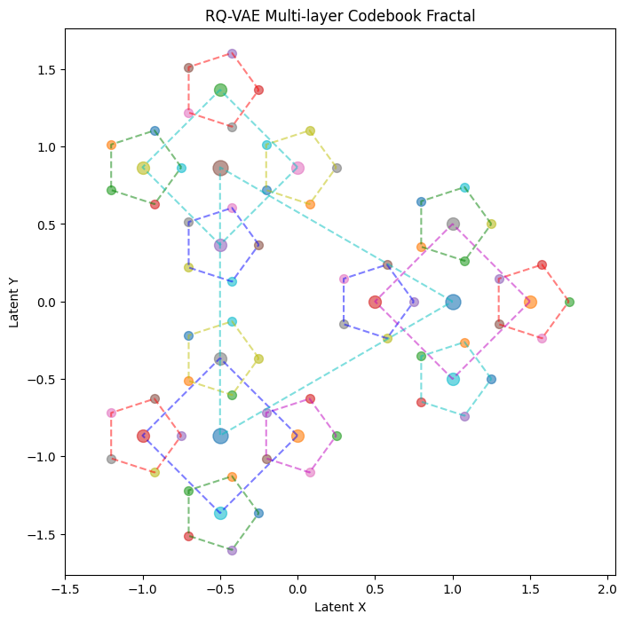

# $$Generative Recommender Systems$$
## $$Author:Jin.Qian$$ $$Date:2026.Jan.2$$
## 1. RQVAE as tokenizer

###  What's the representation of the tokens in the downstream recommendation tasks? The codebook vectors$^{[1]}$ or a new embedding tables$^{[2]}$?
**Remark.1**: The non-invasive$^{[2]}$ method has more flexiblity on co-occurrence modeling than the invasive$^{[1]}$ one, as the fractal structure without proper metric would introduce ambiguity among close tokens from different branches.  
**Remark.2**: Should we distinguish the representation merging process($Tokenization$) and the relationship building process($Generation$)?