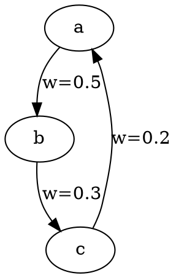

# 复形范畴笔记插图工具说明

## 需要的插图类型

根据笔记内容，需要创建以下类型的插图：

1. **单纯复形的可视化**（Hypergraph形式）
   - 展示0维、1维、2维、3维单纯形
   - 展示复形的整体结构

2. **BPE的余极限过程**
   - 从原子复形通过推出构造逐步聚合为高维Token复形
   - 展示推出构造的交换图

3. **逆向分裂的极限过程**
   - 从全局交互复形通过拉回构造分解为极小原子簇
   - 展示拉回构造的交换图

4. **共轭复形的构造**
   - 展示"顶点-单纯形反转"的过程
   - 原复形与共轭复形的对应关系

5. **有向加权复形**
   - 展示有向边和权重
   - 展示从交互序列到复形的构造过程

## 推荐工具

### 1. TikZ/PGF（LaTeX）

**优点**：
- 与Markdown中的LaTeX数学公式完美集成
- 可以生成高质量的矢量图
- 支持复杂的数学图形和交换图

**使用方法**：
- 在Markdown中使用LaTeX代码块
- 或者生成PDF后转换为PNG/SVG

**示例代码**（单纯复形）：
```latex
\begin{tikzpicture}
  % 顶点
  \node[circle, fill=black, inner sep=2pt] (v1) at (0,0) {};
  \node[circle, fill=black, inner sep=2pt] (v2) at (2,0) {};
  \node[circle, fill=black, inner sep=2pt] (v3) at (1,1.732) {};
  
  % 边（1维单纯形）
  \draw (v1) -- (v2);
  \draw (v2) -- (v3);
  \draw (v1) -- (v3);
  
  % 填充三角形（2维单纯形）
  \fill[blue!20] (v1.center) -- (v2.center) -- (v3.center) -- cycle;
\end{tikzpicture}
```

### 2. Python + Matplotlib/NetworkX

**优点**：
- 灵活，易于编程生成复杂图形
- 可以处理大量数据
- 支持交互式可视化

**需要的库**：
```python
import matplotlib.pyplot as plt
import networkx as nx
from matplotlib.patches import Polygon
import numpy as np
```

**示例代码**（单纯复形）：
```python
import matplotlib.pyplot as plt
from matplotlib.patches import Polygon
import numpy as np

fig, ax = plt.subplots(figsize=(6, 6))

# 顶点坐标
vertices = np.array([[0, 0], [2, 0], [1, np.sqrt(3)]])

# 绘制2维单纯形（三角形）
triangle = Polygon(vertices, alpha=0.3, color='blue')
ax.add_patch(triangle)

# 绘制边（1维单纯形）
for i in range(3):
    ax.plot([vertices[i, 0], vertices[(i+1)%3, 0]], 
            [vertices[i, 1], vertices[(i+1)%3, 1]], 
            'k-', linewidth=2)

# 绘制顶点（0维单纯形）
ax.scatter(vertices[:, 0], vertices[:, 1], s=100, c='black', zorder=5)

ax.set_xlim(-0.5, 2.5)
ax.set_ylim(-0.5, 2.5)
ax.set_aspect('equal')
ax.axis('off')
plt.tight_layout()
plt.savefig('simplex.png', dpi=300, bbox_inches='tight')
```

### 3. Graphviz

**优点**：
- 适合绘制有向图
- 自动布局
- 支持权重标注

**使用方法**：


### 4. Manim（数学动画引擎）

**优点**：
- 可以创建动画展示变换过程
- 适合展示"逐步变形"的过程
- 生成高质量视频

**缺点**：
- 学习曲线较陡
- 渲染时间较长

## 具体插图需求

### 插图1：单纯复形（Hypergraph）示例
- **位置**：基础概念章节
- **内容**：展示一个包含0-3维单纯形的复形
- **工具推荐**：TikZ 或 Python+Matplotlib

### 插图2：BPE的推出构造过程
- **位置**：BPE作为余极限过程章节
- **内容**：
  1. 初始状态：原子复形（顶点）
  2. 中间状态：通过推出构造逐步聚合
  3. 最终状态：高维Token复形
- **工具推荐**：Manim（动画）或 TikZ（静态序列图）

### 插图3：逆向分裂的拉回构造过程
- **位置**：逆向分裂作为极限过程章节
- **内容**：
  1. 初始状态：全局交互复形（有向加权）
  2. 中间状态：通过拉回构造逐步分解
  3. 最终状态：极小原子簇
- **工具推荐**：Manim（动画）或 TikZ（静态序列图）

### 插图4：共轭复形的构造
- **位置**：共轭复形章节
- **内容**：展示原复形 $K$ 和共轭复形 $K^*$ 的对应关系
- **工具推荐**：TikZ 或 Python+Matplotlib

### 插图5：有向加权复形
- **位置**：加权复形与有向单纯复形章节
- **内容**：展示有向边和权重标注
- **工具推荐**：Graphviz 或 Python+NetworkX

### 插图6：交换图（范畴论）
- **位置**：极限与余极限章节
- **内容**：推出和拉回的交换图
- **工具推荐**：TikZ（最擅长绘制交换图）

## 建议的工作流程

1. **使用TikZ创建静态插图**（推荐）
   - 在Markdown中直接嵌入LaTeX代码
   - 或者创建独立的.tex文件，编译后插入图片

2. **使用Python创建复杂可视化**
   - 编写Python脚本生成图片
   - 保存为PNG/SVG格式
   - 在Markdown中引用

3. **使用Manim创建动画**（可选）
   - 创建动画展示变换过程
   - 导出为GIF或视频
   - 在Markdown中嵌入

## 具体实现建议

### 对于Markdown笔记系统

如果您的笔记系统支持LaTeX渲染（如CrossNote），可以直接使用TikZ代码：

```markdown
<div class="tikz-figure">

```latex
\begin{tikzpicture}
  % 您的TikZ代码
\end{tikzpicture}
```

</div>
```

### 如果使用图片文件

1. 使用Python脚本生成图片
2. 保存到笔记目录的`images/`文件夹
3. 在Markdown中使用：``

## 需要我提供的帮助

我可以为您提供：
1. **TikZ代码模板**：针对每种插图类型的完整代码
2. **Python脚本**：生成复形可视化的完整代码
3. **插图位置标记**：在笔记中标记需要插入图片的位置

请告诉我您希望使用哪种工具，我可以提供相应的代码和模板。
